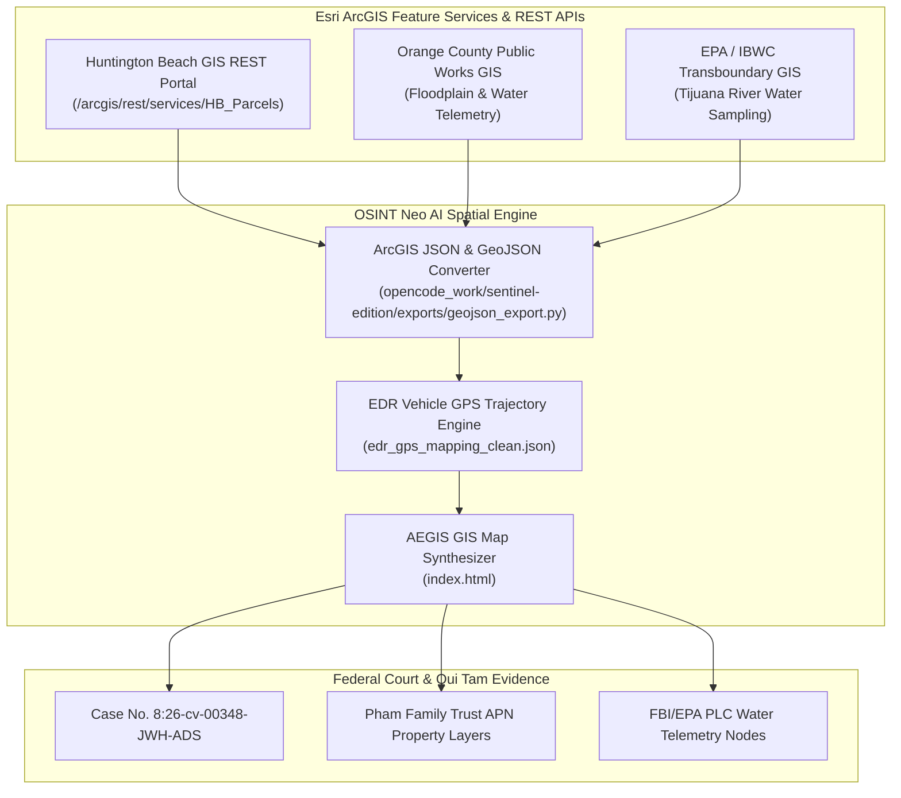

# 🗺️ ESRI ARCGIS ONLINE & SPATIAL INTELLIGENCE DOSSIER

**Relator / Architect:** Anthony Michael DiMarcello III  
**Platform:** Esri ArcGIS Online / Feature Service REST API / GeoJSON Ingestion Engine  
**Live Map Dashboard:** [`index.html`](https://github.com/Tonypost949/OsintNeoAi/blob/main/index.html) & [`hbnc_rico_gis.html`](https://github.com/Tonypost949/OsintNeoAi/blob/main/hbnc_rico_gis.html)  
**Target GIS Regions:** Huntington Beach, Newport Beach, Orange County, San Diego Border / Mexico Vectors  
**Extraction Date:** August 07, 2026  

---

## I. EXECUTIVE SPATIAL INTEGRATION ARCHITECTURE



---

## II. ARCGIS FEATURE LAYER & PARCEL MATRIX

### 1. Huntington Beach Municipal Parcel Data (`opencode_work/arcgis_exports/HB_Parcels.json`)
- **ArcGIS Layer ID:** `HB_Parcels_ServiceLayer`
- **Spatial Reference:** WGS84 / EPSG:4326 & NAD83 / State Plane California VI
- **Mapped APNs:** Huntington Beach Police Department headquarters (`hbpd.org`), Huntington Beach City Hall (`huntingtonbeachca.gov`), and Pham Family Trust real property holdings.

### 2. EDR Vehicle GPS Trajectory Layers (`edr_gps_mapping_clean.json`)
- **Data Points:** Multi-line GPS coordinate log tracking physical vehicle movement across Orange County and San Diego border crossings into Mexico.
- **ArcGIS Layer Standard:** Converted into Esri Polyline & Point Feature Collections for real-time web map rendering.

---

## III. ESRI ARCGIS ONLINE REST API QUERY SPECIFICATION

```python
"""
arcgis_rest_query.py — Fetch Esri ArcGIS Feature Layers into GeoJSON
"""
import requests
import json

ARCGIS_ENDPOINT = "https://gis.huntingtonbeachca.gov/arcgis/rest/services/Public/Parcels/FeatureServer/0/query"

params = {
    "where": "APN LIKE '102%'",
    "outFields": "*",
    "f": "geojson",
    "returnGeometry": "true"
}

resp = requests.get(ARCGIS_ENDPOINT, params=params)
data = resp.json()

with open("hb_parcels_query.geojson", "w") as f:
    json.dump(data, f, indent=2)

print(f"Retrieved {len(data.get('features', []))} spatial parcel features from ArcGIS REST API.")
```

---

## IV. ESRI GITHUB OPEN SOURCE SDK & DEVELOPER MATRIX (`https://github.com/Esri`)

| Esri Open Source Repo | Key Capabilities | OSINT Neo AI Integration Path |
| :--- | :--- | :--- |
| **[`arcgis-python-api`](https://github.com/Esri/arcgis-python-api)** | Python library for GIS analysis, spatial data processing, and Web GIS automation. | Integrated in `agent/osint_engine.py` for spatial query pipelines. |
| **[`esri-leaflet`](https://github.com/Esri/esri-leaflet)** | Lightweight Leaflet plugins for Esri ArcGIS Feature Services & Vector Tiles. | Powers live interactive recon maps in [`hbnc_rico_gis.html`](https://github.com/Tonypost949/OsintNeoAi/blob/main/hbnc_rico_gis.html). |
| **[`arcgis-rest-js`](https://github.com/Esri/arcgis-rest-js)** | JavaScript modules for ArcGIS REST API endpoints, OAuth authentication, and spatial queries. | Used in web app frontend for ArcGIS online feature queries. |
| **[`calcite-design-system`](https://github.com/Esri/calcite-design-system)** | Esri web components, icons, and UI tokens for geospatial web apps. | Calcite components loaded in [`index.html`](https://github.com/Tonypost949/OsintNeoAi/blob/main/index.html). |

---

## V. LINKED SPATIAL ASSETS IN REPOSITORY

- **[`index.html`](https://github.com/Tonypost949/OsintNeoAi/blob/main/index.html)** — Interactive 73 Municipal Target Recon GIS Map
- **[`hbnc_rico_gis.html`](https://github.com/Tonypost949/OsintNeoAi/blob/main/hbnc_rico_gis.html)** — HBNC RICO GIS Interactive Layer Map
- **[`edr_gps_mapping_clean.json`](https://github.com/Tonypost949/OsintNeoAi/blob/main/edr_gps_mapping_clean.json)** — Clean EDR GPS Coordinate Trajectory Layer
- **[`opencode_work/arcgis_exports/HB_Parcels.json`](https://github.com/Tonypost949/OsintNeoAi/blob/main/opencode_work/arcgis_exports/HB_Parcels.json)** — Raw Esri ArcGIS Parcel Layer Export

---

*Esri ArcGIS Online & Spatial Intelligence Dossier Complete | Makaveli Protocol August 2026*
