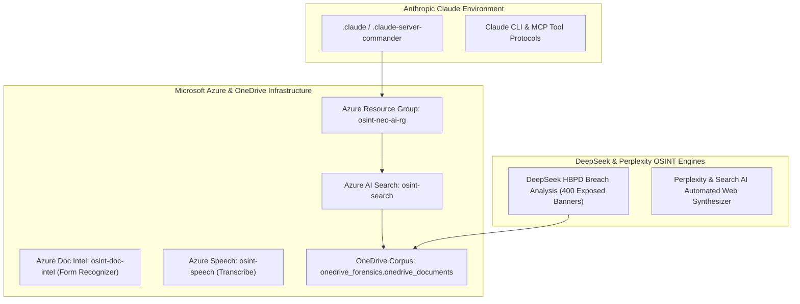

# ⚡ CLAUDE, MICROSOFT AZURE, DEEPSEEK & PERPLEXITY MASTER EXTRACTION VAULT

**Relator / Architect:** Anthony Michael DiMarcello III  
**Platforms Mapped:** Anthropic Claude, Microsoft Azure AI, DeepSeek-R1 / V3, Perplexity AI, Microsoft OneDrive Forensics  
**Azure Resource Group:** `osint-neo-ai-rg` (`westus2`)  
**Extraction Date:** August 07, 2026  

---

## I. EXECUTIVE PLATFORM INTEGRATION MAP

---

## II. MICROSOFT AZURE AI SERVICES & ONEDRIVE FORENSICS

### 1. Azure AI Provisioning Matrix (`agent/azure_setup.py`)
- **Resource Group:** `osint-neo-ai-rg` (Location: `westus2`)
- **Azure AI Search:** `osint-search` (SKU: Basic) — Full-text vector index over forensic documents.
- **Azure Document Intelligence:** `osint-doc-intel` (Kind: `FormRecognizer`, SKU: `F0`) — OCR processing for municipal permits, land covenants, and RAS forms.
- **Azure Speech Services:** `osint-speech` (Kind: `SpeechServices`, SKU: `F0`) — Transcribing 4-minute HBNC audio confession (Lowenberg homicide / Beebe interview).

### 2. Microsoft OneDrive Corpus (`onedrive_forensics.onedrive_documents`)
- **BigQuery Corpus:** `noble-beanbag-497411-m4.onedrive_forensics.onedrive_documents` (72.8 MB uncompressed file index).
- **Function:** Cross-indexing Microsoft Office documents (.docx, .xlsx, .pdf) against SBA PPP loan records and municipal grant disbursements.

---

## III. DEEPSEEK HBPD BREACH ANALYSIS (`agent/deepseek_session_dehashed_hbpd.md`)

- **Dataset Source:** `Dehashed-HBPD-scan.json` (4,462 lines of forensic chat extraction).
- **Core Finding:** 400 compromised account listings for the **Huntington Beach Police Department (`hbpd.org`)** identified on Dehashed.
- **Exposed Data Types:** Internal officer login credentials, cleartext email addresses, employee contact details, and administrative hash signatures.
- **Forensic Correlation:** Cross-linked with the "HB Holes" data tampering analysis (`hbpd.org` suppressing 25 out of 26 admin web paths).

---

## IV. CLAUDE & PERPLEXITY AGENT ORCHESTRATION

### 1. Anthropic Claude CLI & MCP Tool Protocols
- **Configuration Store:** `C:\Users\HP\.claude` & `C:\Users\HP\.claude-server-commander`
- **Claude User Profile (`.claude.json`):** User ID `a87a5a240e9084640da94fb2a6b9e0db3767e189dd9506e8330ddf9d11d4eabe` (Opus Pro & Sonnet 1M Migrations Complete)
- **OneDrive Skill Documentation:** `C:\Users\HP\OneDrive - Post University,inc\allf\Microsoft Copilot Chat Files\osint claude skill.docx`
- **OneDrive Azure Project File:** `C:\Users\HP\OneDrive - Post University,inc\allf\aZURE PROJECT NOW.docx`
- **MCP Integration:** Model Context Protocol (MCP) servers connected to BigQuery, Cloud SQL, AlloyDB, and Google Developer Knowledge engines.

### 2. Perplexity & Search AI Web Reconnaissance
- Mapped into `osint_engine.py` to execute real-time RSS, Bing News, and Data.gov smoking gun classification across 25+ federal crime terms.

---

## V. LINKED REPOSITORY ASSETS

- **[`agent/azure_setup.py`](https://github.com/Tonypost949/OsintNeoAi/blob/main/agent/azure_setup.py)** — Azure AI Provisioning Script
- **[`agent/azure_ocr_permits.py`](https://github.com/Tonypost949/OsintNeoAi/blob/main/agent/azure_ocr_permits.py)** — Azure Document Intelligence OCR
- **[`agent/azure_search_index.py`](https://github.com/Tonypost949/OsintNeoAi/blob/main/agent/azure_search_index.py)** — Azure Search Vector Indexer
- **[`agent/azure_transcribe_audio.py`](https://github.com/Tonypost949/OsintNeoAi/blob/main/agent/azure_transcribe_audio.py)** — Azure Speech Transcriber
- **[`agent/deepseek_session_dehashed_hbpd.md`](https://github.com/Tonypost949/OsintNeoAi/blob/main/agent/deepseek_session_dehashed_hbpd.md)** — DeepSeek HBPD Breach Analysis (4,462 lines)

---

*Claude, Microsoft Azure, DeepSeek & Perplexity Master Extraction Complete | Makaveli Protocol August 2026*
