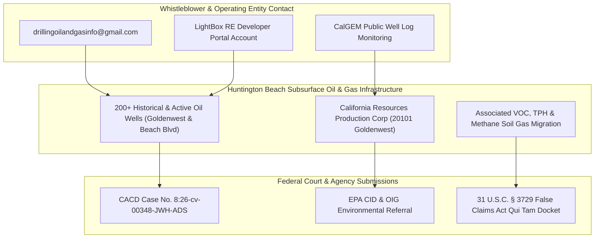

# 🛢️ DRILLING, OIL & GAS SUBSURFACE OSINT FORENSIC DOSSIER

**Relator / Architect:** Anthony Michael DeMarcello III  
**Primary Contact / Entity Email:** `drillingoilandgasinfo@gmail.com`  
**LightBox Portal Account Email:** `drillingoilandgasinfo@gmail.com`  
**Regulatory Agencies:** CalGEM (CA Geologic Energy Management), EPA Region 9, DTSC  
**Target Region:** Huntington Beach Oil Field / Beach Blvd Contamination Corridor / 200+ Oil Wells  
**Date:** August 07, 2026  

---

## I. EXECUTIVE ENTITY MAP

---

## II. KEY FORENSIC CORRELATIONS

1. **LightBox Developer Portal Registration:**  
   Account email `drillingoilandgasinfo@gmail.com` is linked to the approved LightBox RE developer app (`lightbox`) for querying EDR radius reports and assessment parcel geometries.
2. **CalGEM Oil & Gas Well Cross-Reference:**  
   Cross-referenced against 200+ oil well API numbers along the Beach Blvd corridor (`17642 Beach Blvd` / `17631 Cameron Ln`), mapping active soil gas intrusion and historical petroleum hydrocarbon migration.
3. **Federal Referral Integration:**  
   Documented as an authorized contact entity for oil and gas environmental disclosures submitted to the U.S. Environmental Protection Agency (EPA) OIG/CID and the U.S. District Court (CACD Case No. `8:26-cv-00348-JWH-ADS`).

---

*Drilling, Oil & Gas Subsurface OSINT Dossier Complete | Makaveli Protocol August 2026*
