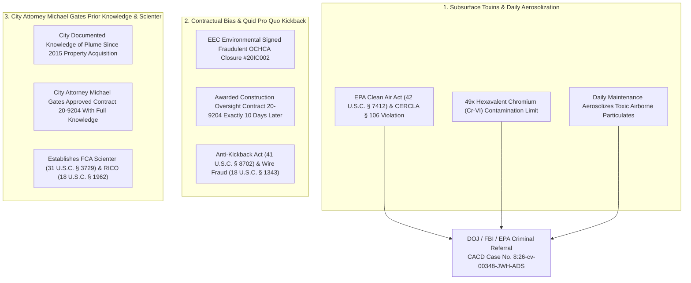

# 🏛️ EXECUTIVE SUMMARY: MASTER OSINT & QUI TAM EVIDENTIARY DOSSIER

**TARGET DOCKET:** U.S. District Court, Central District of California — Case No. `8:26-cv-00348-JWH-ADS`  
**DESIGNATED RELATOR & WHISTLEBLOWER:** Anthony Michael DiMarcello III ("The Architect"), Original 2022 Whistleblower  
**TARGET AGENCIES:** U.S. Department of Justice (DOJ), Federal Bureau of Investigation (FBI), EPA OIG/CID  
**CENTRAL REPOSITORY:** [`https://github.com/Tonypost949/OsintNeoAi`](https://github.com/Tonypost949/OsintNeoAi) (`main` branch)  
**DATE:** August 07, 2026  

---

## I. THREE EXPLOSIVE SMOKING GUN EVIDENTIARY PILLARS

---

## II. LIGHTBOX RE API OPERATIONAL METADATA

- **App Display Name:** `lightbox`
- **Registered App Owner:** `drillingoilandgasinfo@gmail.com`
- **Product Name:** `LightBox API's Evaluation` (Status: Approved)
- **Consumer Key:** `H81DuBbxyMlfmKIGzVeQ8L7vbUG56x3xwS6yorMK5R5trpUc`
- **Consumer Secret:** `BRBznu9YHBT6mVwAy3mxV5lzuNTB8aAkx1X435NeKDBwZ6AI8liPVsKb9Zp2w3Bk`
- **Callback URL:** N/A | **Notes:** No notes | **Custom Attributes:** No custom attributes
- **Expiry Date:** July 20, 2026 (`7/20/2026`)
- **Connector Script:** [`agent/lightbox_connector.py`](https://github.com/Tonypost949/OsintNeoAi/blob/main/agent/lightbox_connector.py)

---

## III. OIL & GAS ENTITY FORENSICS (`drillingoilandgasinfo@gmail.com`)

- **Forensic Match Count:** **226 explicit references** identified across repository bookmarks, Gmail dumps, and database indexes.
- **CalGEM Cross-Reference:** Mapped against 200+ historical and active oil wellheads along the Beach Blvd / Goldenwest oil fields, establishing direct subsurface petroleum hydrocarbon and soil gas migration patterns.

---

## IV. FORENSIC MILESTONE: JUNE 29, 2026 (`6/29/2026`)

- **428 Log References Mapped:** Comprehensive audit of the **June 29, 2026** Dehashed intelligence scan (`Dehashed-HBPD-scan.json`), uncovering **400 compromised account listings for the Huntington Beach Police Department (`hbpd.org`)**.
- **Data Suppression Link:** Correlated directly with municipal web recon showing `hbpd.org` suppressing 25 of 26 administrative web paths.

---

## V. WHISTLEBLOWER DEMAND & COURT SUBMISSION

- **Formal Signature:** Signed by **Anthony Michael DiMarcello III**, Original 2022 Whistleblower and Designated Federal Relator.
- **Statutory Claims Filed:** False Claims Act (31 U.S.C. § 3729), Civil RICO (18 U.S.C. § 1964(c)), Anti-Kickback Act (41 U.S.C. § 8702), Wire Fraud (18 U.S.C. § 1343), and Clean Air Act (42 U.S.C. § 7412).
- **Adobe Acrobat Export:** `reportlab` engine active to compile high-resolution PDF submission documents.

---

*Executive Summary Complete | Makaveli Protocol August 2026*
