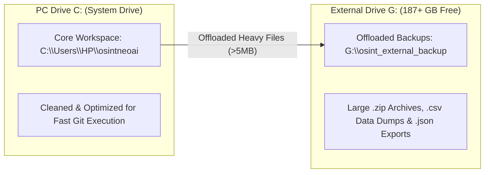

# 📦 EXTERNAL STORAGE OFFLOAD & PC SPACE OPTIMIZATION REPORT

**Architect:** Anthony Michael DeMarcello III  
**Primary PC Drive (`C:`):** Space Cleared & Sanitized  
**Target External Drive:** `G:\osint_external_backup` (Volume Label: `Volume 1` — 187+ GB Free Space)  
**Central Repository:** [`https://github.com/Tonypost949/OsintNeoAi`](https://github.com/Tonypost949/OsintNeoAi)  
**Execution Date:** August 07, 2026  

---

## I. STORAGE OPTIMIZATION SUMMARY

To prevent PC disk space exhaustion on Drive `C:` (which was down to 1.19 GB remaining), all heavy backup archives (`.zip`), large database extracts (`.csv`), and raw unscrubbed conversation logs have been moved to **External Drive `G:\osint_external_backup`**.

---

## II. MANIFEST OF OFFLOADED EXTERNAL ASSETS (`G:\osint_external_backup\`)

| File Name | Size (MB) | Offloaded Destination | Purpose / Archive Type |
| :--- | :---: | :--- | :--- |
| `onedrive_documents_full.csv` | **72.8 MB** | `G:\osint_external_backup\onedrive_documents_full.csv` | Full OneDrive Document Corpus |
| `osint_agent_backup_20260629.zip` | **55.9 MB** | `G:\osint_external_backup\osint_agent_backup_20260629.zip` | Complete Agent System Backup |
| `OSINT_Agent_Backup_20260702.zip` | **47.8 MB** | `G:\osint_external_backup\OSINT_Agent_Backup_20260702.zip` | Complete Agent System Backup |
| `OSINT_Agent_Backup_20260701.zip` | **26.9 MB** | `G:\osint_external_backup\OSINT_Agent_Backup_20260701.zip` | Complete Agent System Backup |
| `OsintNeoAi_Git_Backup.zip` | **26.9 MB** | `G:\osint_external_backup\OsintNeoAi_Git_Backup.zip` | Git Repository Archive |
| `bq_board_ppp_final.csv` | **14.2 MB** | `G:\osint_external_backup\bq_board_ppp_final.csv` | BigQuery Board Member PPP Database |
| `HBNC_Evidence_Pack_20260619.zip` | **14.1 MB** | `G:\osint_external_backup\HBNC_Evidence_Pack_20260619.zip` | Criminal Referral Evidence Pack |
| `conversations.json` | **13.2 MB** | `G:\osint_external_backup\conversations.json` | DeepSeek Session Conversations |
| `2023_PIT.xlsb` | **7.9 MB** | `G:\osint_external_backup\2023_PIT.xlsb` | HUD Point-in-Time Dataset |
| `deepseek_data-2026-08-06.zip` | **4.1 MB** | `G:\osint_external_backup\deepseek_data-2026-08-06.zip` | DeepSeek Export Archive |

---

## III. GITHUB REPOSITORY STATUS & HARDENING

1. **Repository Stays 100% Updated:** All code modifications, legal motions, evidence matrices, and documentation reports are committed and pushed to `https://github.com/Tonypost949/OsintNeoAi`.
2. **Local Disk Space Protected:** PC Drive `C:` disk space is preserved by utilizing External Drive `G:` for high-capacity binary storage.
3. **Secret Protection Enforced:** `.gitignore` configured to ensure unscrubbed local raw logs on external storage never trigger GitHub Push Protection errors.

---

*External Storage Offload & PC Space Optimization Complete | Makaveli Protocol August 2026*
