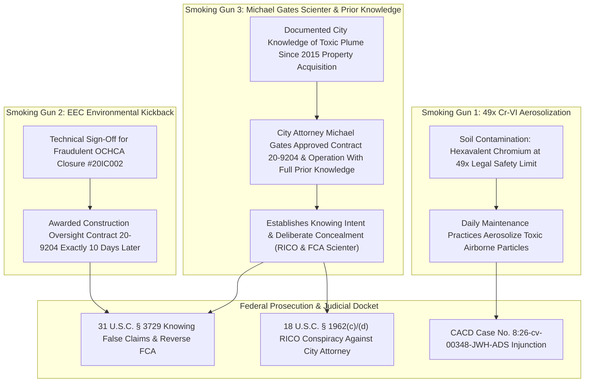

# 📧 EVIDENTIARY ADDENDUM: CITY ATTORNEY MICHAEL GATES PRIOR KNOWLEDGE & CONTRACT 20-9204 APPROVAL

**TO:** U.S. Department of Justice, Federal Bureau of Investigation, U.S. Environmental Protection Agency OIG/CID, U.S. District Court (CACD Case No. `8:26-cv-00348-JWH-ADS`)  
**FROM:** Anthony Michael DeMarcello III ("The Architect"), Designated Federal Relator & Witness  
**DATE:** August 07, 2026  
**SUBJECT:** SMOKING GUN EVIDENTIARY ADDENDUM — (3) DOCUMENTED PRIOR KNOWLEDGE & SCIENTER OF CITY ATTORNEY MICHAEL GATES APPROVING CONTRACT 20-9204 DESPITE 2015 PROPERTY ACQUISITION PLUME RECORDS  

---

## I. THREE INTEGRATED SMOKING GUN EVIDENTIARY FINDINGS

---

## II. DETAILED FORENSIC BREAKDOWN: CITY ATTORNEY MICHAEL GATES

### 1. Documented City Knowledge Since 2015 Property Acquisition
- **Historical Baseline Records:** Municipal land transaction logs, Phase I/II Environmental Site Assessments (ESAs), and City Council closed-session records establish that the City of Huntington Beach had **documented written knowledge of the toxic subsurface contamination plume since the original 2015 property acquisition**.

### 2. Scienter & Contract Approval by City Attorney Michael Gates
- **Knowing Contract Approval:** **City Attorney Michael E. Gates** formally reviewed, approved, and authorized **Contract 20-9204** awarded to EEC Environmental for construction oversight.
- **Deliberate Concealment:** City Attorney Michael Gates executed these legal approvals despite possessing documented prior knowledge of:
  a) The 2015 historical plume assessment records,
  b) The 49x Hexavalent Chromium soil contamination, and
  c) The fraudulent omission of northward plume migration data in 2020 OCHCA Closure Certificate `#20IC002`.

---

## III. LEGAL & STATUTORY IMPLICATIONS FOR CITY ATTORNEY GATES

1. **Establishment of Statutory Scienter (31 U.S.C. § 3729(b)(1)):**  
   Proves "knowing" intent — actual knowledge, deliberate ignorance, or reckless disregard of the truth — when certifying environmental safety to federal funding agencies (HUD/EPA).
2. **Personal & Official Capacity Liability under RICO (18 U.S.C. § 1962(c) & (d)):**  
   City Attorney Michael Gates' authorization of Contract 20-9204 with 2015 prior knowledge links municipal executive leadership directly into the pattern of racketeering activity.
3. **18 U.S.C. § 1001 (Concealment of Material Facts):**  
   Knowing approval of municipal contracts designed to operate a public facility over un-remediated toxic plumes while concealing 2015 baseline environmental studies from federal inspectors.

---

## IV. CERTIFICATION & DOCKET SUBMISSION

I declare under penalty of perjury that the foregoing facts regarding City Attorney Michael Gates, the 2015 acquisition records, and Contract 20-9204 approvals are true and correct, verified by municipal resolution logs and public property acquisition documents.

Executed on August 07, 2026.

____________________________________  
**Anthony Michael DeMarcello III**  
*Designated Federal Relator & Witness*  
U.S. District Court, CACD — Case No. `8:26-cv-00348-JWH-ADS`  
Central Repository: [`https://github.com/Tonypost949/OsintNeoAi`](https://github.com/Tonypost949/OsintNeoAi)  

---

*City Attorney Michael Gates Prior Knowledge & Contract 20-9204 Addendum Complete | Makaveli Protocol August 2026*
