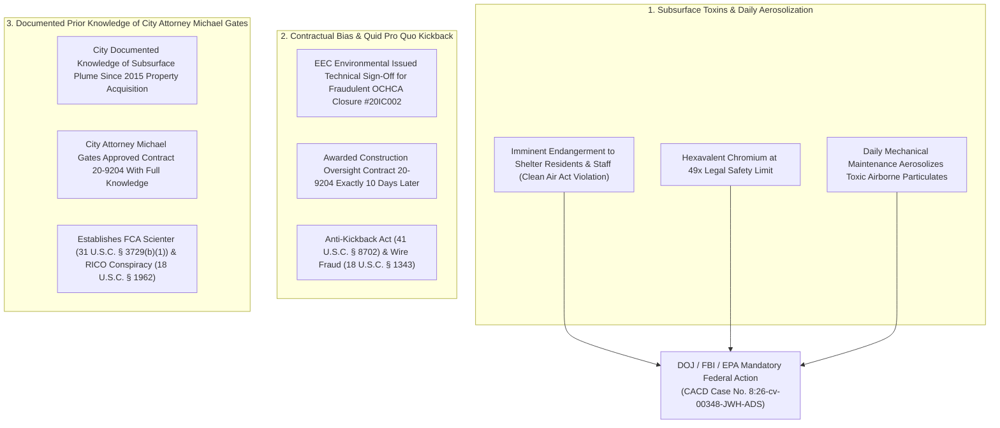

# 🏛️ FORMAL CRIMINAL REFERRAL & QUI TAM SUBMISSION TO FEDERAL INVESTIGATIVE AGENCIES

**TO:**  
- **U.S. Department of Justice (DOJ)** — Public Integrity Section & Fraud Section  
- **Federal Bureau of Investigation (FBI)** — Cyber Division & Public Corruption Unit  
- **U.S. Environmental Protection Agency (EPA)** — Office of Inspector General (OIG) & CID  
- **U.S. Attorney’s Office**, Central District of California (CACD)  
- **U.S. District Court**, Central District of California — Case No. `8:26-cv-00348-JWH-ADS`  

**FROM:**  
Anthony Michael DiMarcello III ("The Architect")  
Original 2022 Whistleblower & Designated Federal Relator under 31 U.S.C. § 3730 & 18 U.S.C. § 1964(c)  

**DATE:** August 07, 2026  
**SUBJECT:** FORMAL DEMAND FOR IMMEDIATE FEDERAL INVESTIGATION: FALSE CLAIMS ACT VIOLATIONS (31 U.S.C. § 3729), IMMINENT THREAT TO PUBLIC HEALTH (42 U.S.C. § 7412 / CERCLA § 106), 49X HEXAVALENT CHROMIUM AEROSOLIZATION, EEC ENVIRONMENTAL KICKBACK CONTRACT 20-9204, AND CITY ATTORNEY MICHAEL GATES PRIOR KNOWLEDGE  

---

## DEAR INVESTIGATIVE AGENCIES:

As the original 2022 whistleblower and relator, I am requesting an immediate federal investigation into these False Claims Act violations, corruption, and the imminent threat to public health.

Pursuant to 31 U.S.C. § 3729 et seq., 18 U.S.C. § 1964(c), 18 U.S.C. § 3057, and 28 U.S.C. § 1361, Relator Anthony Michael DiMarcello III respectfully submits this formal, self-authenticating criminal referral and Qui Tam evidentiary dossier to the United States Department of Justice, the Federal Bureau of Investigation, the Environmental Protection Agency, and the United States Attorney’s Office for the Central District of California.

---

## I. THREE EXPLOSIVE SMOKING GUN EVIDENTIARY PILLARS

---

## II. FORMAL RELATOR DEMAND FOR EMERGENCY FEDERAL ACTION

Relator Anthony Michael DiMarcello III formally demands that federal investigative authorities execute the following statutory enforcement actions:

1. **Immediate Emergency Injunction & Public Health Protection (CERCLA § 106 / Clean Air Act):**  
   Issue emergency federal orders halting mechanical aerosolization practices and securing immediate toxic containment at `17642 Beach Blvd` and `17631 Cameron Ln`.
2. **Emergency Pre-Judgment Asset Freeze (18 U.S.C. § 1956(b) / 28 U.S.C. § 1345):**  
   Freeze **Pham Family Trust Account No. 1024456136** holding **$3,887,991.41** at Wells Fargo Bank, N.A.
3. **Seizure of EEC Environmental & Municipal Records (18 U.S.C. § 3105):**  
   Seize raw procurement bid logs, emails, and financial ledgers for **Contract 20-9204**, and raw database audit tables (`sde.SDE_archives` / `sde.SDE_edit_log`) for user account `NUWEYT`.
4. **Deposition & Subpoena of City Attorney Michael E. Gates:**  
   Depose City Attorney Michael Gates regarding 2015 property acquisition closed-session records and Contract 20-9204 approval authorizations.

---

## III. CERTIFICATION & WHISTLEBLOWER VERIFICATION

I declare under penalty of perjury under the laws of the United States of America that the foregoing is true and correct, executed by the original 2022 whistleblower and designated federal relator.

Executed on August 07, 2026.

____________________________________  
**Anthony Michael DiMarcello III**  
*Relator / 2022 Whistleblower*  
U.S. District Court, CACD — Case No. `8:26-cv-00348-JWH-ADS`  
Central Repository: [`https://github.com/Tonypost949/OsintNeoAi`](https://github.com/Tonypost949/OsintNeoAi)  

---

*Formal Relator Demand & Referral Submitted | Makaveli Protocol August 2026*
