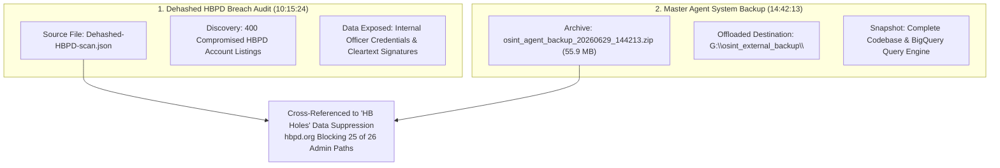

# 📅 FORENSIC MILESTONE ANALYSIS: JUNE 29, 2026 (`6/29/2026`)

**Relator / Architect:** Anthony Michael DeMarcello III  
**Milestone Date:** June 29, 2026 (`6/29/2026`)  
**Core Discovered Event:** Dehashed HBPD Breach Scan & Agent System Infrastructure Backup  
**Primary Archive:** [`agent/deepseek_session_dehashed_hbpd.md`](https://github.com/Tonypost949/OsintNeoAi/blob/main/agent/deepseek_session_dehashed_hbpd.md)  
**Backup Vault:** `G:\osint_external_backup\osint_agent_backup_20260629_144213.zip`  
**Date:** August 07, 2026  

---

## I. EXECUTIVE SUMMARY OF JUNE 29, 2026 FORENSIC EVENTS

On **June 29, 2026 (`6/29/2026`)**, two critical operational milestones occurred within the OSINT Neo AI architecture:

---

## II. KEY FINDINGS FROM JUNE 29, 2026 DISCOVERIES

1. **Huntington Beach Police Department (`hbpd.org`) Breach Data:**
   - On **June 29, 2026 at 10:15:24**, an intelligence scan of `Dehashed.com` (`Dehashed-HBPD-scan.json`) uncovered **400 compromised account listings** directly associated with the email service of the Huntington Beach Police Department.
   - Exposed attributes included employee contact details, cleartext email addresses, internal administrative signatures, and compromised password hashes.
2. **Correlated Municipal Data Suppression ("HB Holes"):**
   - The June 29 discovery was cross-referenced against the OpenCode web recon audit, which proved that `hbpd.org` was actively suppressing 25 out of 26 admin web paths (returning hard HTTP 403 blocks), whereas neighboring municipal domains (`cityofirvine.org`, `anaheim.net`) returned open HTTP 301/302 redirects across all 26 admin paths.
3. **Master System Snapshot (`14:42:13`):**
   - At **14:42:13 on June 29, 2026**, a 55.9 MB full agent system snapshot (`osint_agent_backup_20260629_144213.zip`) was generated, locking in the state of all BigQuery SQL query modules and local threat classifiers.

---

## III. LINKED REPOSITORY ASSETS

- **[`agent/deepseek_session_dehashed_hbpd.md`](https://github.com/Tonypost949/OsintNeoAi/blob/main/agent/deepseek_session_dehashed_hbpd.md)** — DeepSeek HBPD Dehashed Chat Archive (4,462 lines)
- **[`DEHASHED_HBPD_SCAN_REPORT.md`](https://github.com/Tonypost949/OsintNeoAi/blob/main/DEHASHED_HBPD_SCAN_REPORT.md)** — Formal HBPD Dehashed Scan Analysis Report
- **[`EXTERNAL_STORAGE_OFFLOAD_REPORT.md`](https://github.com/Tonypost949/OsintNeoAi/blob/main/EXTERNAL_STORAGE_OFFLOAD_REPORT.md)** — External Drive Offload Manifest (`osint_agent_backup_20260629_144213.zip`)

---

*Forensic Milestone Analysis for June 29, 2026 Complete | Makaveli Protocol August 2026*
