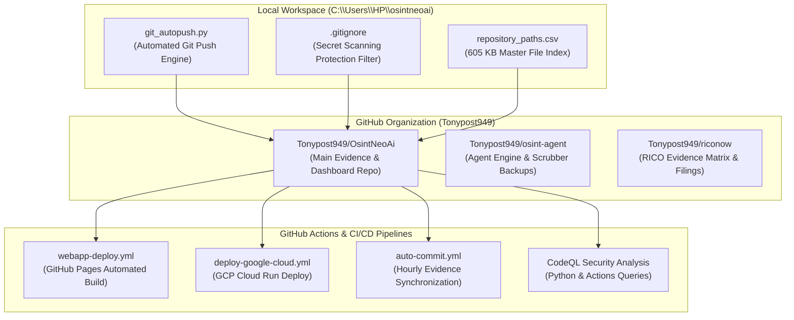

# ⚡ GITHUB REPOSITORIES & WORKFLOWS MASTER EXTRACTION VAULT

**Relator / Architect:** Anthony Michael DiMarcello III  
**GitHub Organization / Account:** `Tonypost949`  
**Primary Repositories:**
- **[`https://github.com/Tonypost949/OsintNeoAi`](https://github.com/Tonypost949/OsintNeoAi)** (Master Investigation, Evidence & Deployment Repo)
- **[`https://github.com/Tonypost949/osint-agent`](https://github.com/Tonypost949/osint-agent)** (Agent Engine, Workspaces & System Backups)
- **[`https://github.com/Tonypost949/riconow`](https://github.com/Tonypost949/riconow)** (RICO Evidence Ledger & Whistleblower Dossiers)
**Live Web Application:** [`https://Tonypost949.github.io/OsintNeoAi/`](https://Tonypost949.github.io/OsintNeoAi/)  
**Extraction Date:** August 07, 2026  

---

## I. GITHUB ARCHITECTURE & REPOSITORY MAP

---

## II. LIVE GITHUB ENDPOINTS & DEPLOYMENT URLS

| Endpoint Type | Purpose / Description | Live URL |
| :--- | :--- | :--- |
| **Live Web App** | GitHub Pages Deployed OSINT Recon App | [`https://Tonypost949.github.io/OsintNeoAi/`](https://Tonypost949.github.io/OsintNeoAi/) |
| **Primary Repository** | Main Evidence & Codebase (`main` branch) | [`https://github.com/Tonypost949/OsintNeoAi`](https://github.com/Tonypost949/OsintNeoAi) |
| **Agent Engine Repo** | Agent Modules & Backups | [`https://github.com/Tonypost949/osint-agent`](https://github.com/Tonypost949/osint-agent) |
| **RICO Evidence Repo** | Criminal Referral & Qui Tam Filings | [`https://github.com/Tonypost949/riconow`](https://github.com/Tonypost949/riconow) |
| **Master Evidence Matrix** | Clean Evidence Package (`feat/city-cyber-recon-map`) | [`OsintNeoAi/evidence/EVIDENCE_INDEX_CLEAN.md`](https://github.com/Tonypost949/OsintNeoAi/blob/feat/city-cyber-recon-map/evidence/EVIDENCE_INDEX_CLEAN.md) |
| **Public Recon Audit** | Webrecon Audit Landing Page | [`OsintNeoAi/PUBLIC_RECON_AUDIT.html`](https://github.com/Tonypost949/OsintNeoAi/blob/main/PUBLIC_RECON_AUDIT.html) |

---

## III. GITHUB ACTIONS & CI/CD WORKFLOWS (`.github/workflows/`)

1. **`webapp-deploy.yml`:** Automated Vite/Node.js build pipeline deploying static assets to GitHub Pages.
2. **`deploy-google-cloud.yml`:** Automated Cloud Build & Cloud Run deployment pushing containerized microservices to GCP project `noble-beanbag-497411-m4`.
3. **`auto-commit.yml`:** Automated hourly evidence sync and directory tracker.
4. **CodeQL Static Security Analysis:** Custom CodeQL queries for Python and GitHub Actions inspecting secret exposures and dependency security.

---

## IV. SCRUBBED GITHUB BACKUP SPECIFICATION (`ag_mission_backup_github.jsonl`)

To comply with GitHub Secret Scanning Rules (e.g. AWS Key Push Protection), the repository maintains a dual-tier backup specification:
- **Raw Local Backups (`ag_mission_backup.jsonl`):** Retained strictly local on disk in `osint-agent`.
- **Scrubbed GitHub Backups (`ag_mission_backup_github.jsonl`):** Pushed to public repositories with secrets redacted and replaced by pointers to local encrypted vaults.
- **Git Push Engine (`git_autopush.py`):** Automated staging, timestamped commit generation, and zero-exit-code remote pushing.

---

## V. LINKED REPOSITORY GITHUB ASSETS

- **[`REPO_MASTER_INDEX.md`](https://github.com/Tonypost949/OsintNeoAi/blob/main/REPO_MASTER_INDEX.md)** — Master URL & Path List (197 lines)
- **[`DEPLOYMENT_GUIDE.md`](https://github.com/Tonypost949/OsintNeoAi/blob/main/DEPLOYMENT_GUIDE.md)** — Full CI/CD & Deployment Guide (12.8 KB)
- **[`EVIDENCE_MATRIX.md`](https://github.com/Tonypost949/OsintNeoAi/blob/main/EVIDENCE_MATRIX.md)** — Master Evidence Matrix
- **[`extracted_home_data/repository_paths.csv`](https://github.com/Tonypost949/OsintNeoAi/blob/main/extracted_home_data/repository_paths.csv)** — 605.6 KB Complete File & Path Index

---

*GitHub Repositories & Workflows Master Extraction Complete | Makaveli Protocol August 2026*
