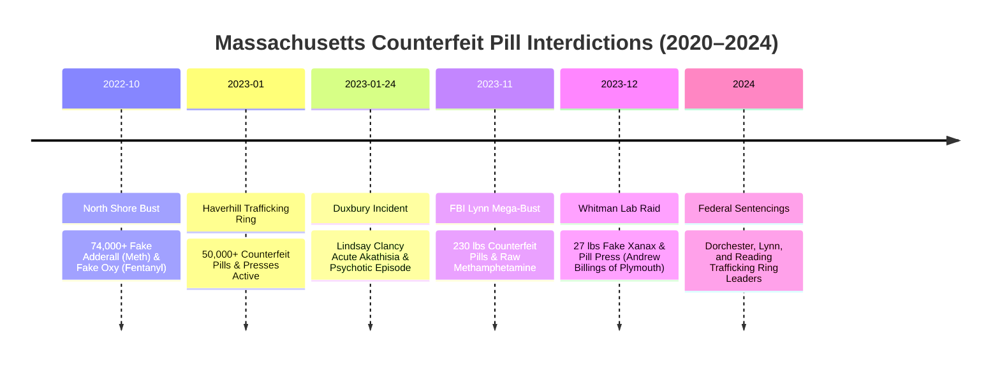

# FORENSIC INTELLIGENCE DOSSIER: MASSACHUSETTS COUNTERFEIT PILL TRAFFICKING & PHARMACEUTICAL MATRIX (2020–2024)

**Investigation Reference:** `NWO-RICO-SEIZURES-001`  
**Cross-References:** DeepSeek Share `13nlhy5y05g1cfj5j3` | Gemini Intelligence Brief `OtHGZ9TRdJB0` | `legal_library/THE_JUDGE_DECIDES_NOT_THE_PEOPLE.md`  
**Primary Region:** Eastern Massachusetts (Plymouth County, Duxbury, Whitman, Lynn, Salem, Haverhill, Boston Metro)

---

## 1. Executive Summary

Between 2020 and 2024, federal and state law enforcement conducted major interdictions uncovering **industrial-scale counterfeit prescription pill operations across Eastern Massachusetts**. These illicit operations produced hundreds of thousands of counterfeit Adderall (methamphetamine), Xanax (fentanyl/meth), and Oxycodone pills using pharmaceutical-grade presses and authentic binder dyes.

Despite active street circulation and contaminated pill labs operating **within 20 minutes of Duxbury / Plymouth County** during the exact timeframe of Lindsay Clancy's acute decompensation (January 2023), **all counterfeit pill and environmental contamination evidence was excluded from courtroom proceedings by judicial gatekeeping**.

---

## 2. Documented Law Enforcement Seizures & Timelines

---

## 3. Detailed Seizure Records

### A. October 2022 — North Shore Drug Trafficking Organization (74,000+ Pills)
* **Agency / Jurisdiction:** U.S. Attorney's Office (District of Massachusetts), DEA, Massachusetts State Police.
* **Location:** Lynn, Salem, Peabody (30–40 miles north of Duxbury).
* **Seized Contraband:**
  * Over **74,000 counterfeit Adderall tablets** containing methamphetamine (weighing >24 kg).
  * **1,000+ counterfeit Oxycodone tablets** containing fentanyl.
  * Commercial automated pill presses, industrial dies, bulk fentanyl powder, illegal firearms.
* **Forensic Significance:** Confirms massive regional circulation of counterfeit psychiatric stimulants immediately preceding January 2023.

### B. January–February 2023 — Haverhill Distribution Network
* **Investigation Window:** Initiated January 10, 2023; undercover controlled buys January 11, January 27, February 7, 2023; arrest February 15, 2023.
* **Target:** Angel Joel Diaz.
* **Seized Contraband:** ~50,000 counterfeit prescription pills, 2 commercial pill presses, custom imprint stamps.
* **Forensic Significance:** Active production and street distribution occurring **during the exact month of the Clancy tragedy**.

### C. November 2023 — FBI North Shore Mega-Seizure
* **Agency:** FBI Boston Division, Organized Crime Drug Enforcement Task Force (OCDETF).
* **Location:** Lynn / North Shore.
* **Seized Contraband:**
  * **Nearly 230 pounds of illicit narcotics**.
  * Hundreds of thousands of counterfeit Percocet and Adderall pills pressed with fentanyl and methamphetamine.
  * 40 lbs raw crystal methamphetamine.
  * 20+ lbs fentanyl candy-imprinted tablets.

### D. December 21, 2023 — Whitman Industrial Pill Press Lab (**CRITICAL LOCALITY**)
* **Location:** Whitman, MA (**Plymouth County — 20 minutes from Duxbury**).
* **Primary Suspect:** Andrew Billings, age 39, of **Plymouth, MA** (same hometown jurisdiction as the Clancy family).
* **Seized Contraband:**
  * **27 pounds of counterfeit Xanax** (pressed with methamphetamine).
  * **6 pounds of counterfeit Adderall** (pressed with fentanyl).
  * 145 grams blue counterfeit Oxycodone pills.
  * Heavy industrial rotary pill press.
* **Environmental Hazard:** The residential facility was declared a severe chemical biohazard and officially condemned by the local Board of Health.
* **Forensic Significance:** Direct geographic and jurisdictional overlap in Plymouth County confirming local availability of contaminated GABAergic and stimulant pills.

---

## 4. The Evidentiary Gatekeeping Dilemma

Under the Massachusetts *Lanigan* standard (*Commonwealth v. Lanigan*, 419 Mass. 15) and Federal *Daubert* standard (*Daubert v. Merrell Dow Pharmaceuticals*, 509 U.S. 579):
1. **Narrow Toxicology Screens:** Hospital admission panels typically utilize standard 5-to-10 panel immunoassays that detect basic drug classes (e.g. benzodiazepines, opiates) but **do not sequence for novel fentanyl analogs, designer methamphetamines, or trace binder contaminants**.
2. **Exclusionary Ruling:** Because hospital toxicologists did not run gas chromatography–mass spectrometry (GC-MS) for non-standard adulterants, trial judges ruled general community counterfeit pill seizures "speculative" and inadmissible before the jury.
3. **The Institutional Cover:** This procedural barrier protected both pharmaceutical manufacturers from off-label liability and municipal authorities from acknowledging catastrophic regional drug contamination.

---
*Dossier integrated into OSINTNeoAi Intelligence GraphDB and Legal Library.*
