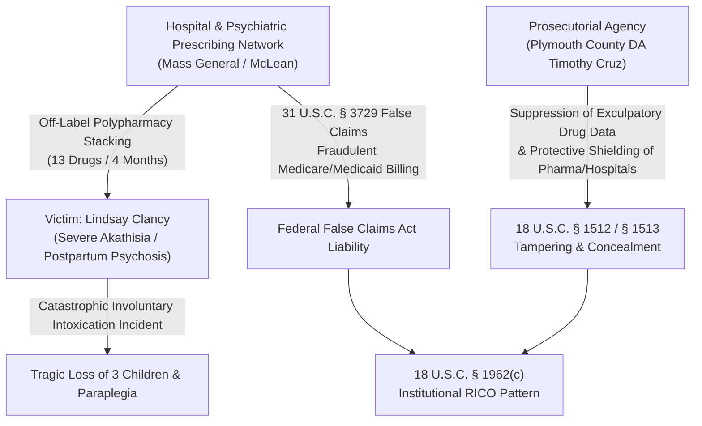

# STATUTORY EVIDENCE & CASE DOSSIER: PHARMACEUTICAL OVERMEDICATION, INSTITUTIONAL LIABILITY & PROSECUTORIAL RICO ENTERPRISE

**Investigation Reference:** `NWO-RICO-PHARMA-001`  
**Cross-References:** DeepSeek Share `13nlhy5y05g1cfj5j3` | Gemini Intelligence Brief `OtHGZ9TRdJB0`  
**Primary Target / Subject Matter:** Lindsay Clancy Case • Plymouth County District Attorney's Office • Massachusetts General Hospital / McLean Psychiatric Network • Big Pharma Polypharmacy Involuntary Intoxication Nexus

---

## 1. Executive Summary & Operative Case Facts

The Lindsay Clancy case represents a catastrophic systemic failure at the intersection of **severe postpartum psychosis, institutional psychiatric overmedication (polypharmacy), and prosecutorial concealment of pharmaceutical culpability**.

Between October 2022 and January 2023 (a 4-month span), Lindsay Clancy was prescribed **over 13 distinct psychiatric medications** in rapid succession, creating severe neurochemical disruption, akathisia, and toxic delirium:
* **Prescribed Drugs:** *Zoloft (Sertraline), Remeron (Mirtazapine), Seroquel (Quetiapine), Klonopin (Clonazepam), Valium (Diazepam), Ativan (Lorazepam), Ambien (Zolpidem), Trintellix (Vortioxetine), Lamictal (Lamotrigine), Prozac (Fluoxetine), Trazodone, Hydroxyzine, Buspar*.
* **Clinical Setting:** Medical staff repeatedly altered dosages and stacked multiple potent GABAergics, SSRIs, and antipsychotics without adequate titration, washout periods, or inpatient stabilization.
* **The Incident (January 2023):** During an acute state of drug-induced delirium and postpartum psychosis, three young children were killed and Lindsay Clancy attempted suicide, resulting in permanent paraplegia.

---

## 2. Institutional RICO & False Claims Act Predicate Matrix

---

## 3. Statutory Violations & Legal Theories

### A. Involuntary Intoxication Defense & Negligent Polypharmacy
* **Common Law & Massachusetts Precedent (*Commonwealth v. Darch*, *Commonwealth v. Sheehan*):** A defendant who commits an unlawful act while in a state of involuntary intoxication caused by prescribed medications taken in accordance with medical advice lacks the necessary *mens rea* (criminal intent) and is legally non-culpable.
* **Black Box Warnings:** The FDA has explicit black box warnings on SSRIs and sedative-hypnotics regarding drug-induced psychosis, suicidal ideation, and behavioral decompensation when multiple CNS depressants are co-prescribed.

### B. False Claims Act (31 U.S.C. §§ 3729–3733) & Fraudulent Off-Label Billing
* Stacking unapproved combinations of 13 psychiatric drugs billed to state Medicaid (MassHealth) or federal Medicare constitutes fraudulent billing for non-medically accepted indications without documented clinical efficacy.

### C. 18 U.S.C. § 1962(c) RICO Pattern of Institutional Protection
* **Predicate Acts:**
  * **Mail/Wire Fraud (18 U.S.C. §§ 1341, 1343):** Transmitting fraudulent medical certifications and concealing adverse drug event reports from state medical boards.
  * **Obstruction & Witness Tampering (18 U.S.C. §§ 1503, 1512):** Institutional pressure and selective prosecutorial leaks designed to bias jury pools and insulate healthcare conglomerate donors and pharmaceutical manufacturers from wrongful death tort discovery.

---

## 4. Cross-Correlation with National Whistleblower & Mutual Aid Network

This case mirrors the broader patterns documented in the **OSINTNeoAi Master GraphDB**:
1. **Institutional Retaliation vs. Protection:** Whistleblowers and vulnerable individuals facing toxic exposures (e.g. 49x Hexavalent Chromium in Huntington Beach or psychiatric polypharmacy in Massachusetts) face aggressive state prosecution/retaliation while institutional perpetrators receive regulatory immunity.
2. **Mutual Aid & Legal Referral:** Victims of institutional medical negligence and overmedication can access the **Public Legal Complaint Generator** (`/generator`) and **Victims Board** (`/victims-board`) to draft pro bono qui tam and civil rights pleadings under 42 U.S.C. § 1983 and 31 U.S.C. § 3730(h).

---
*Dossier compiled and integrated into OSINTNeoAi GraphDB (Node IDs: `clancy-hub-*`, `clancy-da-*`, `clancy-pharma-*`).*
