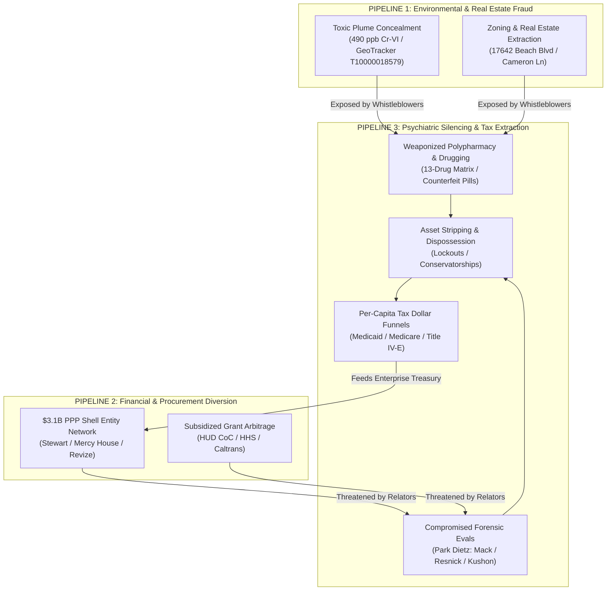
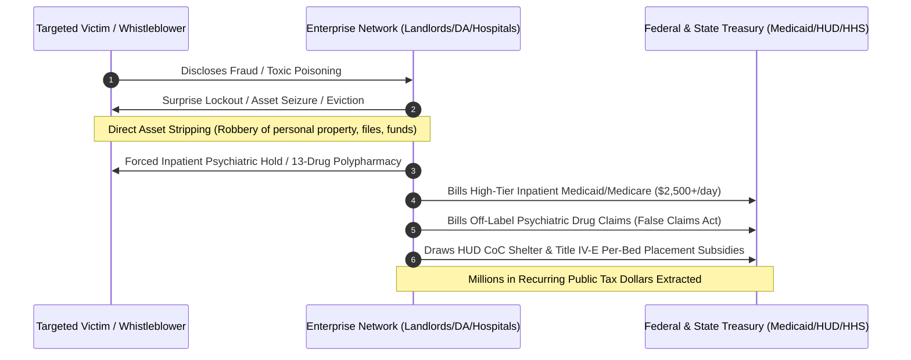

# UNIFIED NWO-RICO MASTER ENTERPRISE BRIEFING (v4)
## THE PSYCHIATRIC DISCREDITATION, ASSET STRIPPING & TAX DOLLAR EXTRACTION PIPELINE

**Investigation Identifier:** `NWO-RICO-MASTER-2026-v4`  
**Classification:** Canonical Relator & Whistleblower Intelligence Dossier  
**Jurisdictions:** California (Orange County / Huntington Beach / Irvine) • Massachusetts (Plymouth County / Duxbury / Boston) • Federal (DOJ / EPA OIG / HUD OIG / HHS OIG / SEC / FinCEN)  
**Primary Statutes:** 18 U.S.C. §§ 1961–1968 (Civil & Criminal RICO) • 31 U.S.C. §§ 3729–3733 (False Claims Act) • 18 U.S.C. §§ 1512, 1513 (Witness Tampering & Retaliation) • 42 U.S.C. § 1983 (Civil Rights Deprivation)

---

## 1. Executive Summary & Enterprise Architecture

The **NWO-RICO Enterprise** operates as a closed, multi-jurisdictional syndicate that coordinates public agency authority, private corporate shell networks, healthcare conglomerates, and forensic gatekeepers to execute a three-part lifecycle:

---

## 2. Pipeline 3 Deep Dive: Psychiatric Weaponization & Discreditation

### A. The "Discredit & Disarm" Protocol
When whistleblowers, reporting physicians (e.g., Dr. Ann Verma), relators, or impacted victims uncover environmental poisoning, procurement embezzlement, or illegal lockouts:
1. **Induced Chemical Decompensation / Polypharmacy Stacking:** Victims seeking medical care for acute stress, toxic exposure symptoms, or retaliation trauma are placed on volatile polypharmacy regimens (e.g., stacking 13 psychiatric medications across GABAergics, SSRIs, and antipsychotics in 4 months).
2. **Akathisia & Delirium Induction:** Rapid dose fluctuations and contraindicated cocktail stacking trigger acute drug-induced delirium, profound akathisia, and cognitive destabilization.
3. **Weaponized Psychiatric Labeling:** Compromised clinical evaluators label the victim's legitimate reports of corruption, surveillance, or contamination as *"paranoid delusions"* or *"persecutory psychosis."*
4. **Evidentiary Neutralization:** By establishing a fraudulent psychiatric paper trail, the enterprise preemptively destroys the victim's credibility before grand juries, law enforcement, and regulatory agencies.

### B. The Controlled Expert Witness Monopoly (Park Dietz Network)
* **Prosecution Rebuttal ("The Hitman"):** Dr. Avram Mack — Deployed to dismiss involuntary intoxication and drug-induced delirium, certifying victims as criminally responsible while ignoring hospital prescribers.
* **Defense Gatekeeper ("Controlled Opposition"):** Dr. Phillip Resnick (Case Western) — Deployed through Park Dietz & Associates to steer legal defense strictly into standard psychiatric culpability, actively suppressing evidence of counterfeit pill distribution, toxic plumes, or institutional kickbacks.
* **Institutional Enforcer:** Dr. Donald Kushon (Drexel University) — Operates within academic medical hierarchies to discipline, silence, and terminate medical whistleblowers (such as Dr. Ann Verma).

---

## 3. Double Financial Extraction: Robbery & Subsidized Tax Funnels

The enterprise does not merely silence targets—it **monetizes every phase of the victim's destruction**:

### 1. Direct Asset Stripping & Dispossession ("Robbery")
* **Constructive & Actual Lockouts:** Executing unannounced, non-judicial lockouts (e.g., Shea Properties / 212 Southbrook on August 4, 2021) to seize legal dossiers, physical evidence, computer workstations, and commodities fiduciary holdings.
* **Incapacity Conservatorships:** Forcing targets into probate or institutional holds to appoint enterprise-friendly conservators who liquidate personal real estate, bank accounts, and civil claims.

### 2. The Tax Dollar Billing Funnel (False Claims Act 31 U.S.C. § 3729)
* **Medicaid (MassHealth / Medi-Cal) & Medicare Upcoding:** Every forced admission, psychiatric evaluation, and off-label polypharmacy prescription is billed to public health programs at maximum reimbursement rates.
* **Title IV-E & Foster Care Extraction:** Funneling children and dependent adults through state removal quotas (e.g., the 29,300 unaccounted children gap in Orange County) to draw recurring federal administrative matching funds.
* **HUD Continuum of Care (CoC) & Homeless Shelter Grants:** Funneling displaced victims into contaminated municipal navigation centers (e.g., 17642 Beach Blvd over 490 ppb Hexavalent Chromium) to justify $10M+ annual operator contracts for shell non-profits (Mercy House).

---

## 4. Cross-Jurisdictional Correlation Table

| Element | California Manifestation (OC / HB) | Massachusetts Manifestation (Plymouth / Duxbury) |
|---|---|---|
| **Predicate Crime Concealed** | 49x Cr-VI Toxic Plume (`T10000018579`) & $3.1B PPP Shell Fraud | Regional Counterfeit Pill Press Operations (Whitman Lab / North Shore) & Off-Label Polypharmacy |
| **Targeted Whistleblower / Victim** | Anthony DiMarcello III (Relator) / Dr. Ann Verma | Lindsay Clancy (Involuntarily Intoxicated Patient) |
| **Silencing Mechanism** | August 4, 2021 Surprise Lockout, Retaliatory Arrests, Character Assassination | 13-Drug Polypharmacy in 4 Months, Akathisia-Induced Delirium, Media Leaks |
| **Forensic Gatekeepers** | OCSD Internal Affairs, Municipal City Attorneys, Retaliatory Medical Boards | Park Dietz & Associates, Dr. Avram Mack, Dr. Phillip Resnick, DA Timothy Cruz |
| **Tax Dollar Extraction** | HUD CoC Grants, City of HB Shelter Contracts, Title IV-E Placements | MassHealth Inpatient Billing, Pharmaceutical Kickbacks, State Hospital Per-Diem Funds |

---

## 5. Federal Statutory Pleading & Enforcement Counts

### COUNT I: 18 U.S.C. § 1962(c) — Conducting Enterprise Through Racketeering
* **Predicate Acts:** Wire Fraud (18 U.S.C. § 1343), Mail Fraud (18 U.S.C. § 1341), Witness Tampering (18 U.S.C. § 1512), Retaliating Against Whistleblowers (18 U.S.C. § 1513), Deprivation of Honest Services.

### COUNT II: 18 U.S.C. § 1962(d) — Conspiracy to Violate RICO
* Agreement between municipal officials, corporate developers, hospital psychiatric prescribers, and forensic consulting firms to conceal predicate offenses and share illicit proceeds.

### COUNT III: 31 U.S.C. § 3729(a)(1)(A)–(B) — Federal False Claims Act
* Knowingly presenting fraudulent claims for federal funds (Medicaid, Medicare, HUD CoC grants, SBA PPP forgiveness) tainted by kickbacks, unapproved off-label polypharmacy, and environmental non-compliance.

### COUNT IV: 42 U.S.C. § 1983 — Civil Rights Conspiracy Under Color of Law
* Coordinated use of law enforcement authority, county prosecutors, and state medical facilities to deprive citizens of liberty, property, and due process without lawful warrant.

---
*Canonical Master Briefing compiled and ingested into OSINTNeoAi Master GraphDB (2,220+ nodes).*
