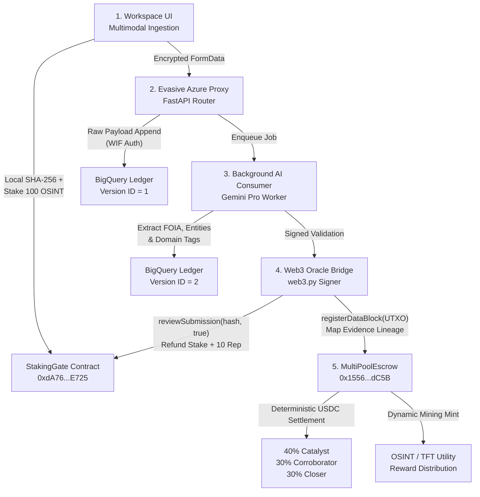

<div align="center">

# ⚡ OSINT Neo AI — Master Architecture
### Tokenized Data Mining, Web3 Intelligence Exchange & Forensic Knowledge Graph Platform

[](LICENSE)
[](https://www.python.org/)
[](https://cloud.google.com/bigquery)
[](https://sepolia.etherscan.io/)
[](https://modelcontextprotocol.io/)
[](https://github.com/Tonypost949/OsintNeoAi)

<p align="center">
  <b>Decentralized Data Mining • Tokenized Bounty Settlement • Multi-Pool Escrow • BigQuery Forensic Graph • 3D Tactical Geospatial Cockpit</b>
</p>

[🌐 Live Demo Cockpit](http://localhost:10000/map/osinteye) • [🔗 Sepolia Contracts](#-live-sepolia-testnet-architecture) • [⚙️ E2E Pipeline](#️-the-e2e-data-mining--intelligence-pipeline) • [🛠️ MCP Tool Catalog](tools/openosint_mcp_server.py) • [🚀 Quickstart](#-quickstart)

---

</div>

## 🌟 Executive Overview

**OSINT Neo AI** is a decentralized, hybrid-cloud open-source intelligence platform and data mining crypto exchange. It bridges **high-throughput Web2 data pipelines** (Google Cloud BigQuery, Azure Cognitive Services) with **Web3 smart contracts** (Ethereum Sepolia) to create a **zero-trust, append-only ecosystem for digital forensics and verifiable investigative bounties**.

The platform turns intelligence gathering and forensic auditing into an incentivized, trustless cryptographic data mining network. Contributors earn automated deterministic payouts in fiat-backed USDC and domain-specific utility tokens (`OSINT`, `TFT`) through verified UTXO-style evidence lineage trees and automated multi-pool escrow contracts.

---

## 🔗 Live Sepolia Testnet Architecture

The core financial, staking, and escrow logic is fully deployed and verified on the **Ethereum Sepolia Testnet**:

| Contract / Asset | Contract Address | Explorer Verification | Purpose |
| :--- | :--- | :--- | :--- |
| **USDC (Settlement)** | [`0x7236F4982a31537d07f3182A1CdAD3f3E4452A53`](https://sepolia.etherscan.io/address/0x7236F4982a31537d07f3182A1CdAD3f3E4452A53#code) | [View on Etherscan](https://sepolia.etherscan.io/address/0x7236F4982a31537d07f3182A1CdAD3f3E4452A53#code) | Primary fiat-pegged settlement asset for whistleblower & investigative bounties |
| **OSINT (Utility Token)** | [`0xA74B3fAfd838fC273f7c6e201B6210AC2b3A0296`](https://sepolia.etherscan.io/address/0xA74B3fAfd838fC273f7c6e201B6210AC2b3A0296#code) | [View on Etherscan](https://sepolia.etherscan.io/address/0xA74B3fAfd838fC273f7c6e201B6210AC2b3A0296#code) | Platform staking collateral, miner reputation weight & access token |
| **TFT (Tax-Funded Token)** | [`0x0977909b254EC33C4D1039135F351B1d3Fb27F14`](https://sepolia.etherscan.io/address/0x0977909b254EC33C4D1039135F351B1d3Fb27F14#code) | [View on Etherscan](https://sepolia.etherscan.io/address/0x0977909b254EC33C4D1039135F351B1d3Fb27F14#code) | Domain-specific mining reward minted for municipal & government audit bounties |
| **StakingGate** | [`0xdA7655b7007a1C7F8191066Bb9A69E4D8987E725`](https://sepolia.etherscan.io/address/0xdA7655b7007a1C7F8191066Bb9A69E4D8987E725#code) | [View on Etherscan ✅](https://sepolia.etherscan.io/address/0xdA7655b7007a1C7F8191066Bb9A69E4D8987E725#code) | Sybil defense gateway collateralizing data submissions (100 OSINT stake required) |
| **MultiPoolEscrow** | [`0x15564C9A8a5903336CC67F2cBa00dBdAd944dC5B`](https://sepolia.etherscan.io/address/0x15564C9A8a5903336CC67F2cBa00dBdAd944dC5B#code) | [View on Etherscan ✅](https://sepolia.etherscan.io/address/0x15564C9A8a5903336CC67F2cBa00dBdAd944dC5B#code) | UTXO provenance graph tracking evidence lineage with automated 40/30/30 deterministic payouts |

---

## 🏛️ Platform Architecture Diagram

```
┌────────────────────────────────────────────────────────┐
│  1. Multimodal Workspace UI & Staking Gate             │
│  • WebRTC Camera / Audio Recorder / Document Ingest    │
│  • Client-side SHA-256 Hashing                         │
│  • MetaMask: stakeAndSubmit(hash) [100 OSINT]         │
└───────────────────────────┬────────────────────────────┘
                            │
                            ▼
┌────────────────────────────────────────────────────────┐
│  2. Evasive Azure Proxy & BigQuery V1 Append           │
│  • FastAPI workspace_api.py router                     │
│  • BigQuery V1 Raw Ledger (Workload Identity Fed)      │
└───────────────────────────┬────────────────────────────┘
                            │
                            ▼
┌────────────────────────────────────────────────────────┐
│  3. Background AI Consumer (Gemini Extraction)         │
│  • Async Entity Extraction (FOIA, Citations, Names)    │
│  • Domain Tagging ([OSINT], [Tax-Funded])             │
│  • BigQuery V2 Enriched Ledger Append                  │
└───────────────────────────┬────────────────────────────┘
                            │
                            ▼
┌────────────────────────────────────────────────────────┐
│  4. Web3 Oracle Bridge (Python web3.py)                │
│  • StakingGate.reviewSubmission(hash, true) -> Refund  │
│  • MultiPoolEscrow.registerDataBlock(UTXO Lineage)     │
└───────────────────────────┬────────────────────────────┘
                            │
                            ▼
┌────────────────────────────────────────────────────────┐
│  5. MultiPoolEscrow Payout Engine & 3D HUD             │
│  • 40/30/30 USDC Split (Catalyst / Corroborator / Close)│
│  • OSINT & TFT Domain Mining Token Minting             │
│  • OSINT Eye View & MapLibre 3D Tactical Cockpits      │
└────────────────────────────────────────────────────────┘
```

---

## ⚙️ The E2E Data Mining & Intelligence Pipeline



### 1. The Workspace UI (Frontend)
The user interface (`workspace_chat.html`) acts as a frictionless chat environment resembling standard LLM interfaces:
- **Multimodal Capture**: Users can upload documents, take physical pictures via WebRTC HTML5 canvas, or record audio memos via `MediaRecorder`.
- **Sybil Defense (Staking Gate)**: Before payload submission, the client computes a local SHA-256 hash and prompts MetaMask to execute `stakeAndSubmit(hash)` on the `StakingGate` contract. Users must stake 100 `OSINT` to deter bot spam.

### 2. Evasive Azure Proxy (API Router)
The frontend sends raw FormData to the FastAPI backend (`workspace_api.py`):
- **File Decoding**: Standard text/PDF files are decoded. Binary media is flagged for downstream Vision processing.
- **BigQuery V1 (Raw Append)**: The payload is immediately logged to the BigQuery Master Ledger (`noble-beanbag-497411-m4`) as `version_id = 1` using Workload Identity Federation (WIF) credentials—eliminating static key vulnerabilities.

### 3. Background AI Consumer
Heavy computational workloads are pushed to the background queue (`background_consumer.py`) to prevent API timeouts:
- **Gemini Extraction**: A Gemini-1.5-Pro micro-worker deeply parses the text, extracts specific entities (e.g., FOIA headers, legal citations, names), and tags the domain (e.g., `[OSINT]`, `[Tax-Funded]`).
- **BigQuery V2 (Enriched Append)**: The structured metadata is appended to BigQuery as `version_id = 2`. The original file remains untouched.

### 4. The Web3 Oracle Bridge
Once the AI validates the data is authentic and not spam, the Python backend signs an Oracle transaction natively using `web3.py`:
- **Lifting Quarantine**: The Oracle calls `reviewSubmission(hash, true)` on the `StakingGate`, refunding the user's `OSINT` stake and granting **+10 Reputation points**.
- **Registering Lineage**: The Oracle maps the data's ancestry onto the blockchain via `registerDataBlock(assetHash, parentHash, minerAddress, domainTags)` on the `MultiPoolEscrow`.

### 5. Automated Multi-Pool Payouts
When a case is solved and an organization deposits fiat-backed `USDC` into the `MultiPoolEscrow`:
- **The UTXO Provenance Graph**: The contract traverses `parentHash` pointers to determine exactly who contributed to the case.
- **The 40/30/30 Split**: Funds are deterministically distributed across the lineage tree:
  - **40%** to the **Catalyst** (First Discoverer).
  - **30%** to the **Corroborator** (Evidence Enricher).
  - **30%** to the **Closer** (Final Verification / Lead Investigator).
- **Domain Minting**: Based on the `domainTags` array, the system dynamically mints secondary utility rewards (`OSINT` or `TFT`) directly to the contributors' Web3 wallets.

---

## 🔒 Security Design (The 5 Vulnerabilities Sealed)

1. **Pointer Corruption**: Eliminated by strict `parentHash` cryptographic linking (UTXO style).
2. **File Forgery**: Prevented by SHA-256 hashing at the point of upload and append-only BigQuery database schemas.
3. **Sybil Attacks**: Mitigated by the Web3 Staking Gate requiring collateralized submissions (100 `OSINT` stake).
4. **Compute Bottlenecks**: Solved by offloading heavy extraction to the asynchronous `background_consumer.py`.
5. **Rate-Limit Guillotine**: Bypassed using off-peak cron caching (`bulk_caching_queue.py`) instead of live API queries.

---

## 🛰️ OSINT Eye View & 3D Geospatial Engine

In addition to the Web3 data mining layer, OSINT Neo AI includes a tactical command cockpit:
- **OSINT Eye View Cockpit** (`/map/osinteye`): Real-time interactive spatial map integrating municipal zoning, utility infrastructure, and environmental monitoring nodes.
- **Animated GPS Scrubber**: Trajectory playback with time-series controls tracking physical entity waypoints.
- **Slide-out Entity Dossier Drawer**: Dynamic HUD slide-out panel querying the 3,510-document evidence ledger in real-time.
- **MapLibre 3D WebGL Extrusions** (`/map/3d`): Hardware-accelerated 3D vector building heights with pitch, bearing, and sun angle simulation.
- **Syncfusion Enterprise Grid** (`/grid`): Multi-column filtering, Excel/CSV export, and deep search across all forensic entities.

---

## 🛠️ OpenOSINT Model Context Protocol (MCP)

OSINT Neo AI provides **19 native MCP tools** registered in `mcp.json` for AI assistants (Antigravity CLI, Claude Code, Gemini CLI):

```json
{
  "mcpServers": {
    "openosint": {
      "command": "python",
      "args": ["C:\\OsintNeoAi\\tools\\openosint_mcp_server.py"]
    }
  }
}
```

### 19 Native MCP Tools:
`osint_lookup_person`, `osint_lookup_email`, `osint_lookup_phone`, `osint_lookup_domain`, `osint_lookup_ip`, `osint_search_entity`, `osint_court_records`, `osint_property_records`, `osint_social_footprint`, `osint_crypto_wallet`, `osint_foia_tracker`, `osint_fca_timeline`, `osint_sec_edgar`, `osint_wayback_history`, `osint_geo_telemetry`, `osint_breach_scanner`, `osint_license_lookup`, `osint_charity_990`, `osint_system_health`.

---

## ⚡ Quickstart

### Local Setup (Windows / Linux / macOS)

```bash
# 1. Clone repository
git clone https://github.com/Tonypost949/OsintNeoAi.git
cd OsintNeoAi

# 2. Install dependencies
pip install -r requirements.txt

# 3. Launch HTTP & WebSocket Map Server
python simple_map_server.py
```

Open your browser at `http://localhost:10000/map/osinteye`.

---

## 📊 Live Endpoints & Routes

| Route | Protocol | Description |
| :--- | :--- | :--- |
| `/map/osinteye` | HTTP / HTML | **OSINT Eye View** Reconnaissance Cockpit with animated timeline scrubber |
| `/map/3d` | HTTP / WebGL | **MapLibre 3D** hardware-accelerated vector building extrusions |
| `/grid` | HTTP / HTML | **Syncfusion Enterprise Grid** with multi-column filtering and CSV/Excel export |
| `/dashboard` | HTTP / HTML | **Executive Forensic Dashboard** with ECharts and FCA statutory timeline |
| `/telemetry` | HTTP / GeoJSON | Live GeoJSON telemetry stream for tactical mapping layers |
| `/api/inspect` | REST / JSON | Real-time entity search querying 3,510 evidence documents with SHA-256 hashes |
| `/health` | REST / JSON | Microservice health check and WebGL engine diagnostic |

---

## 🤝 Contributing & Community

Contributions are welcome! Please follow our established [AGENTS.md](AGENTS.md) multi-agent guidelines and ensure all code submissions include automated test validation.

- **Issues & Bounties**: [GitHub Issues](https://github.com/Tonypost949/OsintNeoAi/issues)
- **Repository**: [https://github.com/Tonypost949/OsintNeoAi](https://github.com/Tonypost949/OsintNeoAi)

---

<div align="center">
  <sub>Built with ❤️ by the OSINT Neo AI Forensic Engineering Team. Licensed under the MIT License.</sub>
</div>
