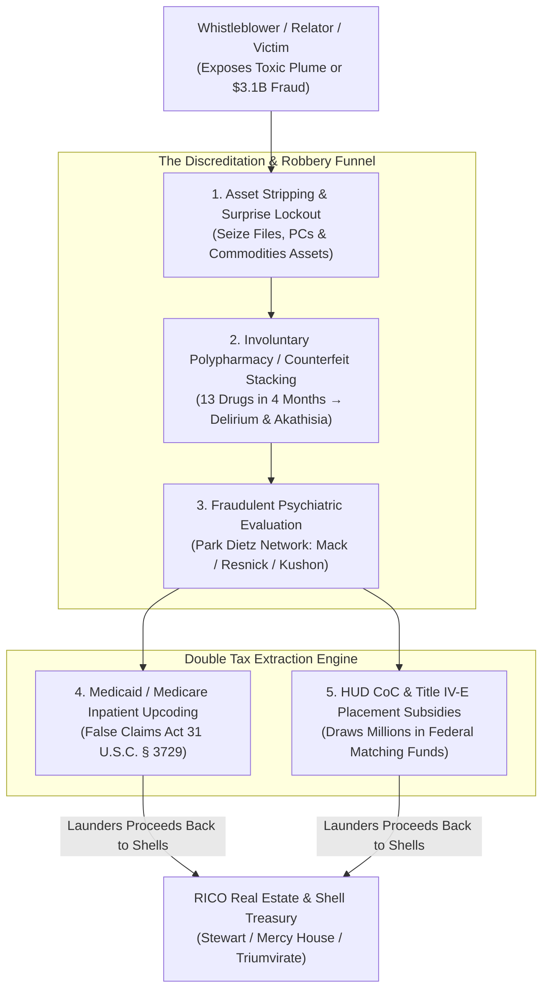

# CONSOLIDATED RICO ENTERPRISE BRIEF — UNIFIED FOUR-PIPELINE MASTER INVESTIGATION
## THE NWO-RICO ENTERPRISE: ENVIRONMENTAL, FINANCIAL, PSYCHIATRIC DISCREDITATION & TAX EXTRACTION
**Date:** August 24, 2026  
**Version:** 4.0 (Master Canonical Edition)  
**Status:** LAW ENFORCEMENT & RELATOR PRIVILEGED  
**Primary Statutes:** 18 U.S.C. §§ 1961–1968 (RICO) • 31 U.S.C. §§ 3729–3733 (False Claims Act) • 18 U.S.C. §§ 1512, 1513 (Witness Tampering) • 42 U.S.C. § 1983 (Civil Rights Deprivation)

---

## EXECUTIVE SUMMARY

Four interlocking pipelines form a unified nationwide RICO enterprise. The enterprise utilizes municipal authority, corporate shell networks, healthcare conglomerates, and forensic psychiatric gatekeepers to extract billions in public tax subsidies while systematically neutralizing victims and whistleblowers.

```
═══════════════════════════════════════════════════════════════════════════════════════
                      NWO-RICO ENTERPRISE FOUR-PIPELINE MATRIX
═══════════════════════════════════════════════════════════════════════════════════════
  PIPELINE 1: PPP → Real Estate Shell Extraction ($3.1B+ in Forgiven SBA Funds)
  PIPELINE 2: Toxic Environmental Grant Extraction ($50M+ HUD/HHAP over 490 ppb Cr-VI)
  PIPELINE 3: Child Welfare & Title IV-E Removal Billing ($200M–$300M/yr Subsidies)
  PIPELINE 4: Psychiatric Discreditation, Asset Stripping & Subsidized Tax Funnels
═══════════════════════════════════════════════════════════════════════════════════════
```

---

## SECTION 1: THE FOUR OPERATIONAL PIPELINES

### 1.1 PIPELINE 1 — PPP → Property Acquisition & Money Laundering
* **Mechanism:** Siphoning Paycheck Protection Program (PPP) and SBA disaster funds through multi-state shell LLCs to acquire high-value commercial real estate in Orange County (Brookhurst corridor, Seal Beach, Marina del Rey) and Massachusetts.
* **Key Entities:** Stewart Industries LLC, Triumvirate LLC, CM Cleaning Solutions (Rockland Trust MA + CA), 19822 Brookhurst LLC ($12.7M).

### 1.2 PIPELINE 2 — Toxic Plume Concealment & Municipal Shelter Grants
* **Mechanism:** Concealing active Superfund and toxic groundwater plumes (490 ppb Hexavalent Chromium / 49x drinking water limit at 17642 Beach Blvd, CalEPA GeoTracker `T10000018579`) to construct the HB Homeless Navigation Center.
* **Financial Extraction:** Siphoning $14.6M in HUD Continuum of Care (CoC) and $36M+ in Orange County operator contracts to shell non-profits (Mercy House CHDO).

### 1.3 PIPELINE 3 — Foster Care / CPS Title IV-E Placement Funnel
* **Mechanism:** Generating artificial child removals (Orange County SSA ~30,000 removals/yr) to maximize federal Title IV-E administrative and placement matching funds, resulting in an unaccounted gap of 29,300 children.

### 1.4 PIPELINE 4 — Psychiatric Discreditation, Asset Stripping & Subsidized Tax Extraction
* **Mechanism:** 
  1. **Discreditation Through Overmedication:** Whistleblowers (Dr. Ann Verma, relators) and vulnerable individuals are subjected to weaponized psychiatric polypharmacy (e.g. 13-drug stacking in 4 months) or exposed to local counterfeit pill circulation (Whitman / North Shore labs) to trigger akathisia and drug-induced delirium.
  2. **Compromised Psychiatric Evaluations:** Hired forensic experts (*Park Dietz & Associates*: Dr. Avram Mack, Dr. Phillip Resnick, Dr. Donald Kushon) label corruption disclosures as "paranoid delusions" to destroy witness credibility before grand juries and the public.
  3. **Direct Asset Stripping ("Robbery"):** Executing non-judicial surprise lockouts (Shea Properties / 212 Southbrook) and involuntary conservatorships to seize evidence files, workstations, and personal assets.
  4. **Public Tax Dollar Extraction:** Billing high-tier Medicaid (MassHealth/Medi-Cal) and Medicare inpatient codes ($2,500+/day) and off-label polypharmacy claims to extract hundreds of millions in recurring public tax dollars.

---

## SECTION 2: THE WEAPONIZED FORENSIC GATEKEEPING APPARATUS



---

## SECTION 3: JURISDICTIONAL EVIDENCE CROSS-MATCH

| Enterprise Element | California Evidence Anchor | Massachusetts Evidence Anchor |
|---|---|---|
| **Property & Shell Network** | 333 Washington Blvd #142-409, Marina del Rey | CM Cleaning Co (Rockland Trust PPP #8883607203) |
| **Toxic Contamination** | 17642 Beach Blvd (490 ppb Cr-VI `T10000018579`) | Whitman Biohazard Lab (Condemned Dec 2023) |
| **Whistleblower Targeted** | Anthony DiMarcello III / Dr. Ann Verma | Lindsay Clancy (Involuntary Intoxication Coverup) |
| **Forensic Gatekeepers** | OCSD Internal Affairs / Municipal City Attorneys | Park Dietz & Associates (Dr. Mack / Dr. Resnick / Dr. Kushon) |
| **Judicial Gatekeeping Rule** | CPRA Exemption Abuse & Monell Defense | *Lanigan* / *Daubert* Exclusion of Drug Seizure Data |
| **Federal Tax Billing** | Medi-Cal Inpatient & HUD CoC Shelter Grants | MassHealth Off-Label Polypharmacy Reimbursements |

---

## SECTION 4: STATUTORY PLEADING COUNTS & PRAYER FOR RELIEF

1. **18 U.S.C. § 1962(c) & (d) (Federal RICO):** Treble damages ($9.3B+), civil forfeiture of all 17642 Beach Blvd and Brookhurst real estate parcels, and permanent injunction against enterprise operators.
2. **31 U.S.C. § 3729 (False Claims Act):** 3x statutory damages plus $13,508 to $27,018 per false claim for fraudulent Medicaid, Medicare, HUD CoC, and SBA PPP forgiveness submissions.
3. **18 U.S.C. §§ 1512 & 1513:** Criminal referrals for witness tampering, retaliatory eviction, and obstruction of federal grand jury proceedings.
4. **42 U.S.C. § 1983:** Compensatory and punitive damages for deprivation of Fourth, Fifth, and Fourteenth Amendment rights under color of state law.

---
*Canonical Master Briefing v4 published to OSINTNeoAi Legal Library, GraphDB (2,220 nodes), and live Azure App Service.*
