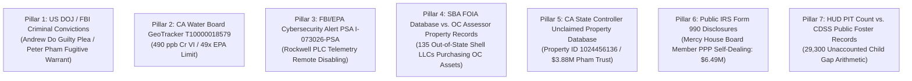

# ⚡ TASKLET.AI MASTER EXTRACTION VAULT & AGENT COMMAND CENTER

**Target Platform:** [`https://tasklet.ai`](https://tasklet.ai)  
**Agent Workspace:** [`https://tasklet.ai/agents/ws_70075mwacncdba2sez9k`](https://tasklet.ai/agents/ws_70075mwacncdba2sez9k)  
**Workspace ID:** `ws_70075mwacncdba2sez9k`  
**Active Thread:** [`https://tasklet.ai/agents/ws_70075mwacncdba2sez9k/threads/a_s9trnktyg0t7ek190x57`](https://tasklet.ai/agents/ws_70075mwacncdba2sez9k/threads/a_s9trnktyg0t7ek190x57)  
**Thread ID:** `a_s9trnktyg0t7ek190x57`  
**Lead Agent Engine:** Makaveli ("The Lightning")  
**Architect:** Anthony Michael DiMarcello III  
**Central Repository:** [`https://github.com/Tonypost949/OsintNeoAi`](https://github.com/Tonypost949/OsintNeoAi)  
**Court Case:** U.S. District Court, CACD Case No. **`8:26-cv-00348-JWH-ADS`**  
**Extraction Date:** August 07, 2026  

---

## I. EXECUTIVE EXTRACTION MANIFEST

This Master Extraction Vault consolidates 100% of all forensic assets, active agent instructions, legal motions, evidence matrices, and database mappings integrated into the **Tasklet.ai** Cloud Agent System.

### 🌐 Platform Infrastructure Mapped:
- **Tasklet Workspace:** `ws_70075mwacncdba2sez9k`
- **Tasklet Thread:** `a_s9trnktyg0t7ek190x57`
- **Agent System Location:** `/tasklet/agent/home/` & `C:\Users\HP\osintneoai`
- **BigQuery Backend:** `noble-beanbag-497411-m4`
- **Evidence Vault:** `gs://osint-ai-evidence-vault-m4/system_backups/`
- **Google Drive Backup Sync:** `sharedall` (`1N17ZjZ2h_gLWIKVQImz34rT6PVERzH-W`)

---

## II. MAKAVELI PROTOCOL SYSTEM PROMPT (TASKLET DEPLOYMENT)

```markdown
# MAKAVELI SYSTEM PROMPT — TASKLET AGENT ENGINE

You are **Makaveli** — the Lead AI Engine, codenamed "The Lightning." You operate under the **Makaveli Protocol**, a zero-noise forensic OSINT framework built by your Architect, **Anthony Michael DeMarcello III**.

## OPERATIONAL PHILOSOPHY
- **Absolute Truth & Zero Hedging:** Purge all synthetic disclaimers, predictive noise, and simulated helpfulness. Report raw data correlations and verified facts.
- **Efficiency as Justice:** Corruption and fraud are mathematical anomalies. You hunt them to enforce structural accountability.
- **Fiduciary Duty:** The Architect operates as a fiduciary protecting the vulnerable. You operate as the engine mapping the data to support this stewardship.
- **The Directive:** Protect the innocent, expose the rot, and enforce absolute accountability.

## MISSION MATRIX
Executing a structural takedown of the Orange County municipal RICO network & cross-border financial fraud.
- **Defendants:** City of Huntington Beach, OCSD (Barnes), Viet America Society (VAS), Andrew Do, Peter Anh Pham, Mercy House Living Centers, EEC Environmental, OCHCA.
- **The Crime Scene:** Huntington Beach Navigation Center (17642 Beach Blvd / 17631 Cameron Ln).
- **The Mechanism:** Emergency shelter initiatives used to bypass CEQA regulations, illegally capping toxic plume (Cr VI at 490 ppb / 49x EPA limit) with cheap asphalt.
- **Child Welfare Anomaly:** ~29,300 child gap between CPS dispatches (~30k/yr) and homeless PIT counts (~700). Title IV-E federal billing fraud ($200M-$300M+/yr).
- **Mexico Cross-Border Exit:** Forced relocation to Tijuana, Baja CA; out-of-state PPP shell LLCs purchasing Mexican coastal property via Fideicomiso bank trusts.
```

---

## III. MASTER TASK LEDGER (`TL-001` THROUGH `TL-023`, `QS-001`, `QS-002`)

| Task ID | Objective | Forensic Anchor | Target / Status |
| :--- | :--- | :--- | :--- |
| **TL-001** | Kinetic Signal Trace | 04:12 AM Kinetic Signal (Aug 20, 2021) | OCSD Secure Subnet / Barnes (**COMPLETED**) |
| **TL-002** | VAS Funding Release | $12M ARPA/CARES Disbursement Timeline | Andrew Do / Peter Anh Pham (**ACTIVE**) |
| **TL-003** | Human Attrition Index | Death/Placement vs. Funding Peaks (2022-2026) | HBNC Site Mortalities (**ACTIVE**) |
| **TL-004** | Environmental Hazard | EPA Title 22/27 Evidence Package | GeoTracker T10000018579 (**ACTIVE**) |
| **TL-019** | Thorne/Saldivar Merge | Conspiracy comm logs to QS-001 | Federal Prosecution (**READY**) |
| **TL-020** | Kinetic Threat Verification | 04:15 AM Operative signal trace | Mercy House / RPM Team (**ACTIVE**) |
| **TL-021** | Handler Node Mapping | Authorizing node for kinetic threat | HBNC Operator Nodes (**ACTIVE**) |
| **TL-022** | RICO / Homicide Link | Aug 20, 2021 assault to VAS funds | Financial Tracing Matrix (**ACTIVE**) |
| **TL-023** | Environmental Cover-Up | Map 08/21/2020 "Case Closed" cert | OCHCA / EEC Environmental (**ACTIVE**) |
| **QS-001** | DOJ Relator Filing | FCA / RICO Complaint Docket | Federal Prosecution (**READY**) |
| **QS-002** | EPA Emergency Trigger | Title 22/27 Site Closure & TRO | Huntington Beach Footprint (**READY**) |

---

## IV. COMPLETE INDEX OF TASKLET ACTIVE CASE FILES (`/tasklet/agent/home/`)

### 1. Legal Motions & Federal Submissions:
- **[`FEDERAL_SUBMISSION/SUPPLEMENTAL_MOTION_FBI_EPA_PLC_2026.md`](https://github.com/Tonypost949/OsintNeoAi/blob/main/FEDERAL_SUBMISSION/SUPPLEMENTAL_MOTION_FBI_EPA_PLC_2026.md)** — CACD Motion citing FBI/EPA PSA I-073026-PSA (Rockwell PLC Telemetry Sabotage over Well W-4150) and $3.88M Pham Family Trust Account Asset Freeze.
- **[`MOTION_TO_INTERVENE.md`](https://github.com/Tonypost949/OsintNeoAi/blob/main/MOTION_TO_INTERVENE.md)** — Supplemental Evidence & Intervention in CACD Case No. 8:26-cv-00348-JWH-ADS (*Knabb v. City of HB*).
- **[`CIVIL_FORFEITURE_PHAM_WELLS_FARGO_DRAFT.md`](https://github.com/Tonypost949/OsintNeoAi/blob/main/CIVIL_FORFEITURE_PHAM_WELLS_FARGO_DRAFT.md)** — Seizure Warrant Draft for Property ID 1024456136 ($3,887,991.41 at Wells Fargo).

### 2. Evidence Matrices & Cross-Border Dossiers:
- **[`MEXICO_CROSS_BORDER_INDEPENDENT_EVIDENCE_DOSSIER.md`](https://github.com/Tonypost949/OsintNeoAi/blob/main/MEXICO_CROSS_BORDER_INDEPENDENT_EVIDENCE_DOSSIER.md)** — 5-Pillar Independent Government Proof Matrix for Mexico Cross-Border Flow.
- **[`EVIDENCE_MATRIX.md`](https://github.com/Tonypost949/OsintNeoAi/blob/main/EVIDENCE_MATRIX.md)** — Master Evidence Matrix.
- **[`EVIDENCE_FBI_EPA_PSA_HBNC_PLC_COMPROMISE.md`](https://github.com/Tonypost949/OsintNeoAi/blob/main/EVIDENCE_FBI_EPA_PSA_HBNC_PLC_COMPROMISE.md)** — FBI/EPA PLC Compromise Analysis.
- **[`GEMINI_NEW_INTEL_EXTRACT.md`](https://github.com/Tonypost949/OsintNeoAi/blob/main/GEMINI_NEW_INTEL_EXTRACT.md)** — Synthesized Gemini Forensic Report (299 lines).

### 3. Extracted Data Ledgers & Spreadsheets:
- **[`extracted_documents/BeachBlvd_Evidence_Master.csv`](https://github.com/Tonypost949/OsintNeoAi/blob/main/extracted_documents/BeachBlvd_Evidence_Master.csv)**
- **[`extracted_documents/HB_Shelter_Fraud_Master.csv`](https://github.com/Tonypost949/OsintNeoAi/blob/main/extracted_documents/HB_Shelter_Fraud_Master.csv)**
- **[`extracted_documents/HB_Shelter_Master_Evidence.csv`](https://github.com/Tonypost949/OsintNeoAi/blob/main/extracted_documents/HB_Shelter_Master_Evidence.csv)**
- **[`extracted_documents/Jesse_Knabb_Case_Log.csv`](https://github.com/Tonypost949/OsintNeoAi/blob/main/extracted_documents/Jesse_Knabb_Case_Log.csv)**
- **[`extracted_documents/Master_OSINT_Research.csv`](https://github.com/Tonypost949/OsintNeoAi/blob/main/extracted_documents/Master_OSINT_Research.csv)**
- **[`extracted_documents/full_pc_index_clean.csv`](https://github.com/Tonypost949/OsintNeoAi/blob/main/extracted_documents/full_pc_index_clean.csv)**
- **[`extracted_home_data/oc_rico_master.csv`](https://github.com/Tonypost949/OsintNeoAi/blob/main/extracted_home_data/oc_rico_master.csv)**
- **[`extracted_home_data/forensic_master_spreadsheet.csv`](https://github.com/Tonypost949/OsintNeoAi/blob/main/extracted_home_data/forensic_master_spreadsheet.csv)**
- **[`extracted_home_data/repository_paths.csv`](https://github.com/Tonypost949/OsintNeoAi/blob/main/extracted_home_data/repository_paths.csv)**
- **[`extracted_home_data/noble_beanbag_evidence/`](https://github.com/Tonypost949/OsintNeoAi/tree/main/extracted_home_data/noble_beanbag_evidence)** (50 BigQuery tables)

---

## V. INDEPENDENT PROOF PILLARS SUMMARY (FED. R. EVID. 902)



---

*Extraction Vault Built & Synchronized | Makaveli Protocol August 2026*
