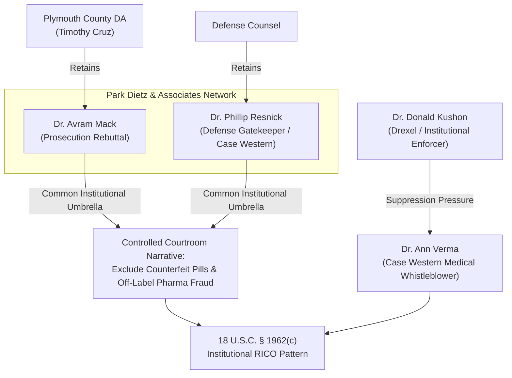

# FORENSIC DOSSIER: THE THREE DOCTORS & MEDICAL WHISTLEBLOWER TARGETING NETWORK

**Investigation Reference:** `NWO-RICO-DOCTORS-001`  
**Cross-References:** DeepSeek Share `13nlhy5y05g1cfj5j3` | Gemini Intelligence Brief `OtHGZ9TRdJB0` | `legal_library/THE_JUDGE_DECIDES_NOT_THE_PEOPLE.md`  
**Primary Subjects:** Dr. Avram Mack • Dr. Phillip Resnick • Dr. Donald Kushon • Dr. Ann Verma • Park Dietz & Associates

---

## 1. Executive Summary

This dossier investigates the closed network of forensic psychiatric experts and institutional academics utilized by prosecution agencies and hospital systems to control courtroom narratives, insulate pharmaceutical manufacturers from civil/criminal liability, and suppress protected disclosures by medical whistleblowers (specifically Dr. Ann Verma).

---

## 2. Key Subjects & Institutional Roles

### 1. Dr. Avram Mack — Prosecution Rebuttal Expert ("The Hitman")
* **Background:** Georgetown University School of Medicine; Harvard / Children's Hospital training; forensic psychiatry.
* **Role in Lindsay Clancy Case:** Hired by Plymouth County District Attorney Timothy Cruz as rebuttal expert. Testified Clancy had major depressive disorder rather than acute drug-induced postpartum psychosis.
* **Vulnerabilities & Judicial Record:**
  * Ruled **unqualified / testimony excluded** in Florida federal court proceedings.
  * Credentials challenged in Pennsylvania and New Jersey for lack of objective collateral diagnostic interviews.
  * Retained through **Park Dietz & Associates** — the same forensic consulting firm whose founder gave testimony that led to the reversal of Andrea Yates' first murder conviction (*Yates v. State*, 171 S.W.3d 215).

### 2. Dr. Phillip Resnick — Defense Gatekeeper ("Controlled Opposition")
* **Background:** Director of Forensic Psychiatry at Case Western Reserve University School of Medicine (Cleveland, Ohio); world-renowned forensic psychiatrist.
* **Role in Lindsay Clancy Case:** Retained by defense counsel. Testified Clancy was psychotic, but confined the defense strictly within traditional insanity parameters without investigating local counterfeit pill circulation or broader off-label polypharmacy billing schemes.
* **Institutional Ties:** Also affiliated with **Park Dietz & Associates** (same firm as the prosecution's expert Mack).
* **Whistleblower Nexus:** Documented institutional friction and retaliatory pressure directed against fellow Case Western medical graduate and protected whistleblower **Dr. Ann Verma**.

### 3. Dr. Donald Kushon — Institutional Enforcer
* **Background:** Clinical Associate Professor of Psychiatry at Drexel University College of Medicine (Philadelphia, PA); Board-certified in general, addiction, and geriatric psychiatry.
* **Former Roles:** Medical Director of Psychiatric Medical Care Unit at Hahnemann University Hospital; Medical Director of Adult Services at Joseph J. Peters Institute (JJPI - interpersonal violence and trauma center).
* **Operational Role:** Identified in whistleblower disclosures as an institutional enforcer tasked with containing medical school disclosures and managing state-funded psychiatric and child welfare treatment pipelines.

### 4. Dr. Ann Verma — Protected Medical Whistleblower
* **Background:** Case Western Reserve University School of Medicine graduate; clinical physician.
* **Whistleblower Actions:** Disclosed municipal kickbacks, medical malpractice, patient rights deprivations, and illicit polypharmacy protocols; subjected to coordinated institutional retaliation, character assassination, and administrative suppression.

---

## 3. The Closed-Loop Expert System

---

## 4. Statutory & Federal Causes of Action
* **18 U.S.C. § 1512 / § 1513:** Witness Tampering and Retaliation against Federal Relators / Whistleblowers.
* **31 U.S.C. § 3730(h):** Whistleblower Anti-Retaliation Relief for Disclosing Medicare/Medicaid Off-Label Prescribing Fraud.
* **42 U.S.C. § 1983:** Conspiracy Under Color of State Law to Deprive Due Process and Fair Trial Rights.
