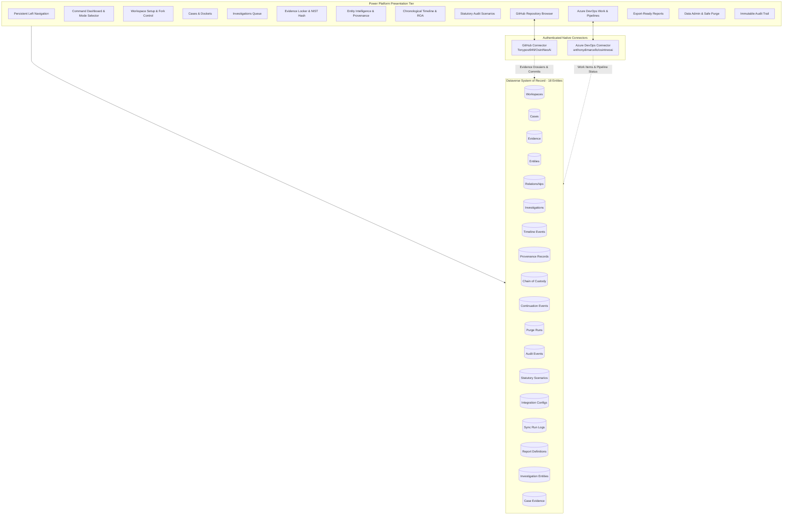

# 🏛️ OsintNeoAi Studio — Enterprise Power Platform Solution Specification
**Solution Name:** `OsintNeoAiStudio`  
**Publisher:** `OsintNeoAi` (`osintneoai`)  
**Target Environment:** Post University Microsoft Power Platform / Azure for Students  
**System of Record:** Microsoft Dataverse (18 Governed Entities)  
**Connected Ecosystems:** GitHub (`Tonypost949/OsintNeoAi`) & Azure DevOps (`anthonydimarcello/osintneoai`)  
**Target Version:** `1.1.0.0`  
**Classification:** Enterprise Forensic Intelligence, Legal Case Operations & Governed Multi-Tenant Workspaces  

---

## 1. Executive Architecture & Governed Workspace Framework



---

## 2. Complete 18-Entity Dataverse Model

### 2.1 Entity Catalog & Schemas

1. **`cr_workspaces` (Workspace Containers)**:
   * `cr_workspaceid` (PK), `cr_name`, `cr_mode` (Choice: Benchmark Reference, Clean Slate, Authorized Continuation), `cr_sourceworkspaceid` (Lookup), `cr_ownerid` (Lookup), `cr_status`, `cr_issampledatapolicy` (Boolean).
2. **`cr_cases` (Cases & Dockets)**:
   * `cr_caseid` (PK), `cr_workspaceid` (Lookup), `cr_casenumber` (Indexed), `cr_casename`, `cr_jurisdiction`, `cr_court`, `cr_status`, `cr_filingdate`, `cr_assignedinvestigator` (Lookup), `cr_notes`.
3. **`cr_evidence` (Evidence Locker)**:
   * `cr_evidenceid` (PK), `cr_workspaceid` (Lookup), `cr_exhibitnumber` (Unique Auto-ID: `EX-#####`), `cr_evidencetype`, `cr_description`, `cr_sha256hash` (64-char Hex), `cr_custodian`, `cr_collectiondate`, `cr_verificationstatus`, `cr_sourceurl`, `cr_fileattachment`.
4. **`cr_entities` (Entity Intelligence)**:
   * `cr_entityid` (PK), `cr_workspaceid` (Lookup), `cr_entityname`, `cr_entitytype`, `cr_riskscore` (Auto-calculated), `cr_riskbasis`, `cr_description`.
5. **`cr_relationships` (Entity Network Edges)**:
   * `cr_relationshipid` (PK), `cr_workspaceid` (Lookup), `cr_sourceentityid` (Lookup), `cr_targetentityid` (Lookup), `cr_relationshiptype`, `cr_notes`.
6. **`cr_investigations` (Work Streams)**:
   * `cr_investigationid` (PK), `cr_workspaceid` (Lookup), `cr_investigationname`, `cr_caseid` (Lookup), `cr_priority`, `cr_status`, `cr_leadinvestigator` (Lookup), `cr_summary`.
7. **`cr_timelineevents` (Chronological Log)**:
   * `cr_timelineeventid` (PK), `cr_workspaceid` (Lookup), `cr_investigationid` (Lookup), `cr_eventdatetime`, `cr_eventtype`, `cr_title`, `cr_description`, `cr_source`, `cr_evidenceid` (Lookup).
8. **`cr_provenancerecords` (AI Derivation & Grounding)**:
   * `cr_provenanceid` (PK), `cr_workspaceid` (Lookup), `cr_relatedrecordid`, `cr_sourcetype`, `cr_sourcereference`, `cr_evidencehashreference`, `cr_derivationmethod`, `cr_modelversion`, `cr_confidence` (Decimal), `cr_verificationstate`, `cr_timestamp`.
9. **`cr_continuationevents` (Fork & Clone Telemetry)**:
   * `cr_continuationid` (PK), `cr_sourceworkspaceid` (Lookup), `cr_destinationworkspaceid` (Lookup), `cr_initiatinguser` (Lookup), `cr_authorizedaction`, `cr_timestamp`, `cr_notificationstatus`, `cr_auditreference`.
10. **`cr_purgeruns` (Safe Data Wipe Ledger)**:
    * `cr_purgerunid` (PK), `cr_workspaceid` (Lookup), `cr_requestedby` (Lookup), `cr_approvedby` (Lookup), `cr_scope`, `cr_previewcounts` (JSON), `cr_status`, `cr_executiontime`, `cr_resultsummary`, `cr_auditreference`.
11. **`cr_chainofcustodyevents` (Immutable Custody Ledger)**:
    * `cr_custodyeventid` (PK), `cr_evidenceid` (Lookup), `cr_actor`, `cr_action`, `cr_timestamp`, `cr_witnessnotes`.
12. **`cr_auditevents` (Immutable Activity Review)**:
    * `cr_auditid` (PK), `cr_workspaceid` (Lookup), `cr_actor`, `cr_action`, `cr_recordid`, `cr_timestamp`, `cr_outcome`, `cr_beforeaftercontext`.
13. **`cr_statutoryauditscenarios` (Configurable Legal Models)**:
    * `cr_scenarioid` (PK), `cr_workspaceid` (Lookup), `cr_scenarioname`, `cr_authoritycited`, `cr_grossbaseamount`, `cr_statutoryrate`, `cr_calculatedoutput`, `cr_assumptionsnotes`, `cr_author`, `cr_disclaimernotice`.
14. **`cr_reportdefinitions` (Export-Ready Dossiers)**:
    * `cr_reportid` (PK), `cr_reportname`, `cr_reporttype`, `cr_filtersjson`, `cr_createdby`.
15. **`cr_investigationentities` (M:N Bridge)**:
    * `cr_bridgeid` (PK), `cr_investigationid` (Lookup), `cr_entityid` (Lookup), `cr_roleinmatrix`.
16. **`cr_caseevidence` (M:N Bridge)**:
    * `cr_caseevidenceid` (PK), `cr_caseid` (Lookup), `cr_evidenceid` (Lookup), `cr_admissibilitystatus`.
17. **`cr_integrationconfigs`**:
    * `cr_configid` (PK), `cr_environmentname`, `cr_targetrepo`, `cr_targetorg`, `cr_projectname`, `cr_status`.
18. **`cr_integrationsyncruns`**:
    * `cr_syncrunid` (PK), `cr_configid` (Lookup), `cr_syncstart`, `cr_syncend`, `cr_recordsaffected`, `cr_status`, `cr_errorlog`.

---

## 3. Four Governed Workspace Modes

| Mode | Name | Data Initialization Policy | Tool & Connector State | Telemetry & Audit Action |
| :--- | :--- | :--- | :--- | :--- |
| **`MODE A`** | **Benchmark Reference** | Pre-loaded with canonical DiMarcello / Anaheim Cabal records (`cr_issampledata = true`). | Default production connectors & AI pipelines active. | Baseline reference locked against unauthorized overwrite. |
| **`MODE B`** | **Clean Slate** | Empty tables. Zero benchmark or author-specific records. | All forensic tools, neural OCR, schemas, and connectors 100% active at default state. | Workspace initialization logged to `cr_auditevents`. |
| **`MODE C`** | **Authorized Continuation / Fork** | Copies selected benchmark records into new isolated workspace; preserves original benchmark lineage. | Full pipeline access with source attribution links. | Dispatches real-time notification to solution administrator (`anthony.dimarcello@students.post.edu`) and logs to `cr_continuationevents`. |
| **`MODE D`** | **Safe Data Purge** | Two-step preview and purge of investigative record rows in target workspace. | **Tool Preservation**: Zero disruption to Dataverse schemas, Power Fx rules, connectors, workflows, or audit history. | Recorded with approval signatures in `cr_purgeruns`. |

---

## 4. AI Grounding, Provenance & Validation Rules

### 4.1 Cryptographic SHA-256 Rule
```powerfx
// Enforce 64-character hexadecimal SHA-256 before verification
If(
    cr_verificationstatus = 'cr_verificationstatus'.NISTVerified,
    If(
        IsMatch(Self.Text, "^[a-fA-F0-9]{64}$"),
        Notify("SHA-256 Hash Cryptographically Validated", NotificationType.Success),
        Error("Verification Failed: Hash must be a valid 64-character hexadecimal SHA-256 string.")
    )
)
```

### 4.2 Provenance Binding & Non-Legal Advice Standard
* Every entity assertion, relationship edge, and timeline entry links to a corresponding `cr_provenancerecords` row detailing:
  - Source type (`Court Docket`, `Regulatory Notice`, `Police Blotter`, `NIST Photo`).
  - Evidence hash reference (`cr_sha256hash`).
  - Derivation method and confidence score.
* All statutory recovery models display mandatory prominent notice: `"ANALYTICAL MODEL ONLY — NOT FORMAL LEGAL ADVICE"`.

---

## 5. Deployment & Target Environment Metadata

| Parameter | Configuration Value |
| :--- | :--- |
| **Solution Name** | `OsintNeoAiStudio` (Version `1.1.0.0`) |
| **Application ID** | `aea4876c-1dbb-4e7c-8024-79443ffb7e40` |
| **Project Model ID** | `170d7b5d-aff1-4ad5-8b92-f8b3d46a1707` |
| **Live Player URL** | [Launch OsintNeoAi Studio App](https://apps.powerapps.com/play/e/584c706d-38a2-e52e-b6e3-24a809f10508/app/aea4876c-1dbb-4e7c-8024-79443ffb7e40?tenantId=dc2273e5-b77e-4b19-ae61-f4b69fb7609c) |
| **Vibe Studio Editor URL** | [Edit in Power Apps Vibe Studio](https://vibe.powerapps.com/e/584c706d-38a2-e52e-b6e3-24a809f10508/s/00000001-0000-0000-0001-00000000009b/w/modelType/project/modelId/170d7b5d-aff1-4ad5-8b92-f8b3d46a1707/app) |
| **Dataverse Publisher** | `OsintNeoAi` (`osintneoai`) |
| **Environment Name** | `Anthony DiMarcello's Environment` |
| **Environment ID** | `584c706d-38a2-e52e-b6e3-24a809f10508` |
| **Tenant ID** | `dc2273e5-b77e-4b19-ae61-f4b69fb7609c` (`Post University,inc.`) |
| **User Principal Object ID** | `c5674a1f-1717-40d6-93c1-85db367b64d5` |
| **User Email** | `anthony.dimarcello@students.post.edu` |
| **Cluster Environment** | `Prod` (Geo: `US`, URI Suffix: `us-il107.gateway.prod.island`) |
| **Power Apps Player Version**| `3.26082.6` |
| **GitHub Repository** | `Tonypost949/OsintNeoAi` (`https://github.com/Tonypost949/OsintNeoAi`) |
| **Azure DevOps Organization**| `anthonydimarcello` (`https://dev.azure.com/anthonydimarcello/osintneoai`) |


