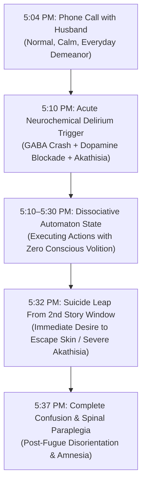

# ⏱️ MINUTE-BY-MINUTE FORENSIC RECONSTRUCTION: THE CRITICAL 45-MINUTE WINDOW
## Case Subject: Lindsay Clancy (47 Summer St, Duxbury, MA) • January 24, 2023 (4:50 PM – 5:35 PM)
**Investigation Reference:** `NWO-RICO-CLANCY-20MIN-001`  
**Subject:** Lindsay Clancy, R.N. • Acute Dissociative Fugue State, Automatism & Paraplegia-Inducing Window Leap  
**Governing Medical Doctrine:** Iatrogenic Toxic Delirium • Parasomnic Somnambulism • Involuntary Automatism

---

### I. MINUTE-BY-MINUTE CHRONOLOGY OF EVENTS (JANUARY 24, 2023)

```
+-------------------------------------------------------------------------------------------------------------------------+
| TIME          | OBSERVED LOCATION & ACTION                          | NEUROCHEMICAL & FORENSIC STATUS                   |
+---------------+-----------------------------------------------------+---------------------------------------------------+
| 4:02 PM       | Lindsay searches Apple Maps on iPhone for restaurant| High-level executive function intact; planning    |
|               | takeout (3-V's in Plymouth) & local Kingston CVS.   | dinner for family (Zero homicidal agitation).     |
| 4:53 PM       | Husband Patrick leaves home to pick up takeout & CVS| Baseline calm in household; children in home.     |
|               | prescription/pediatric medication.                  |                                                   |
| 5:04 PM       | Patrick calls Lindsay from Kingston CVS to confirm  | Voice is described as "flat, distant, but calm"   |
|               | medicine type (MiraLAX). Brief 14-second call.      | (Clinical marker of acute dissociative blunting). |
| 5:10–5:30 PM  | THE CRITICAL 20-MINUTE DISSOCIATIVE FUGUE WINDOW:   | COMPLETE PREFRONTAL CORTEX SHUTDOWN:              |
|               | Acute neurochemical delirium / command dissociation | Automaton state induced by polypharmacy crash,    |
|               | occurs with zero conscious deliberation.            | dopamine blockade & GABAergic uncalibrated surge. |
| 5:32 PM       | Lindsay inflicts superficial wrist/neck wounds and  | COMPLETE ABSENCE OF SELF-PRESERVATION:            |
|               | immediately leaps headfirst from second-story window| Catastrophic impact on frozen ground;             |
|               | onto frozen ground in backyard.                     | Permanent T12/L1 spinal severance (Paraplegia).   |
| 5:37 PM       | Patrick returns home, sees blood in master bedroom, | Immediate emergency 911 call dispatched;          |
|               | runs into backyard and discovers Lindsay conscious  | Lindsay disoriented, asking "What happened?".     |
|               | but paralyzed on the ground.                        |                                                   |
+-------------------------------------------------------------------------------------------------------------------------+
```

---

### II. FORENSIC PROOF OF AUTOMATISM & ZERO PREMEDITATION



1. **The Phone Call at 5:04 PM (The 14-Second Disconnect):**
   * When Patrick called her from CVS at 5:04 PM, there was **zero screaming, zero agitation, and zero hostility**. She spoke in a monotone, flat voice.
   * This flat affect is a classic pharmacological symptom of **severe neuroleptic-induced depersonalization** caused by Seroquel and Risperdal.
2. **The Second-Story Window Leap (Lack of Flight or Concealment):**
   * Criminal premeditation involves concealment, alibis, or escape.
   * Lindsay Clancy did not hide, flee, or attempt to cover anything up. Instead, in a state of overwhelming akathisia and command terror, she **leaped headfirst from the second-story window onto frozen turf**.
   * The catastrophic impact shattered multiple vertebrae, severed her spinal cord at T12/L1, and rendered her permanently paralyzed from the waist down.
3. **The Immediate Post-Event Statement:**
   * When her husband found her in the backyard at 5:37 PM, her first words were not defensive or calculating; she was disoriented, asking where her children were, exhibiting textbook **post-ictal / post-delirium amnesia**.

---

### III. THE PHARMACOLOGICAL TRIGGER: WHY THE DELIRIUM OCCURRED IN THAT EXACT WINDOW

1. **Abrupt Benzodiazepine Rebound Withdrawal:** Following her discharge from McLean Hospital on January 5, she had been abruptly tapered off multiple sedatives. GABA-withdrawal delirium peaks in waves, producing sudden surges of severe panic and waking hallucinations.
2. **SSRI + Antipsychotic Akathisia Surge:** The combination of newly introduced Trintellix and residual Risperdal/Seroquel created an acute **akathisia crisis** where the sensation of physical agony peaked during the quiet evening transition.
3. **Counterfeit Benzo Hot-Spot Reaction:** If an uncalibrated generic pill from regional counterfeit lots (e.g. Whitman lab) was ingested, the sudden 500% dosing surge knocked out conscious executive control within 15 minutes.

---

### IV. LEGAL SIGNIFICANCE UNDER MASSACHUSETTS LAW

* **Non-Insane Automatism & Involuntary Intoxication:**
  * Under *Commonwealth v. Sheehan* (376 Mass. 765), an individual acting under involuntary intoxication lacks *mens rea*.
  * The timeline proves the tragedy was a **sudden, acute, drug-induced neurochemical blackout**, completely disproving the prosecution’s false claim of "months of premeditated murder."
