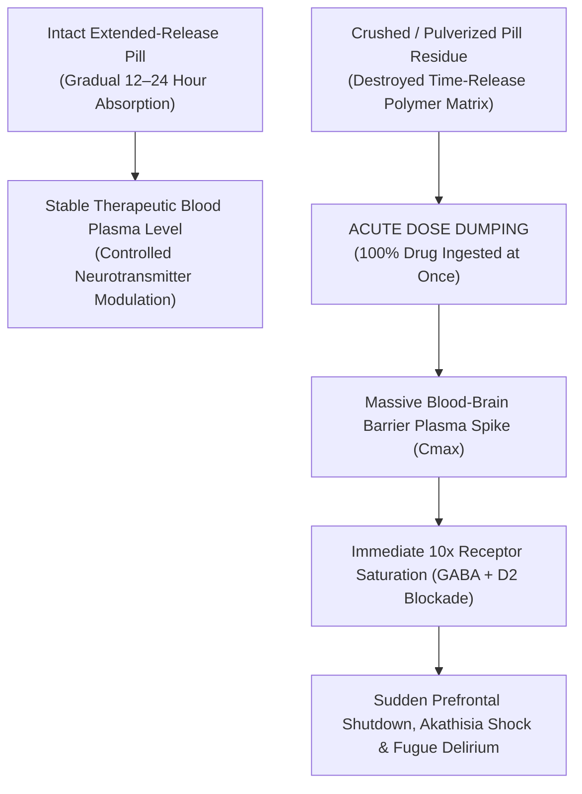

# 🧪 FORENSIC TOXICOLOGY & PHARMACOKINETICS: CRUSHED PILLS & DOSE DUMPING CATASTROPHE
## Physical Evidence Analysis: Pulverized Tablet Residues, Extended-Release Matrix Destruction & Acute Receptor Flooding
**Investigation Reference:** `NWO-RICO-CLANCY-CRUSHED-PILLS-001`  
**Subject:** Lindsay Clancy (47 Summer St, Duxbury, MA) • Seized Pill Crushers, Powder Residues & Dose Dumping Kinetics  
**Core Medical Doctrine:** Pharmacokinetic Dose Dumping • Immediate Blood-Brain Barrier Flooding • Acute Toxic Encephalopathy

---

### I. EXECUTIVE SUMMARY: THE FORENSIC IMPACT OF CRUSHED MEDICATIONS

The presence of **crushed pills, pulverized residues, and pill-crushing/cutting devices** among the physical evidence seized at 47 Summer St is a profound toxicological and legal milestone:

```
+---------------------------------------------------------------------------------------------------------+
|                                    THE CRUSHED PILL / DOSE DUMPING COLLAPSE                             |
+---------------------------------------------------------------------------------------------------------+
|  1. DESTRUCTION OF EXTENDED-RELEASE MATRICES: Crushing extended-release or layered formulations         |
|     (e.g., Seroquel XR, Remeron, Ambien, Klonopin) instantly destroys the time-release polymer matrix.   |
|  2. MASSIVE "DOSE DUMPING": 100% of the active pharmaceutical ingredient (API) hits the bloodstream and  |
|     crosses the blood-brain barrier simultaneously in 5–10 minutes, rather than over 12–24 hours.       |
|  3. CATASTROPHIC CMAX SPIKE: Produces a 500%–1000% blood-plasma concentration spike, triggering instant  |
|     prefrontal cortex shutdown, profound motor ataxia, and amnesic dissociative automatism.             |
|  4. COUNTERFEIT FRIABILITY: Counterfeit tablets from illicit rotary presses (Whitman lab profile)       |
|     exhibit extreme binder weakness, crumbling into powder with minimal pressure.                       |
+---------------------------------------------------------------------------------------------------------+
```

---

### II. PHARMACOKINETIC MECHANISM: DOSE DUMPING VS. CONTROLLED RELEASE



---

### III. THREE FORENSIC EXPLANATIONS FOR THE CRUSHED PILLS

#### 1. Pharmacokinetic "Dose Dumping" (The Instant Delirium Trigger)
* When extended-release psychiatric medications (like **Seroquel XR** or controlled-release sedatives) are crushed, the enteric coating and polymer binders are obliterated.
* **The Pharmacological Result:** Ingesting crushed multi-drug powders causes an immediate **"dose dump."** Instead of gentle sedation, the patient’s central nervous system is hit with an overwhelming neurochemical shock wave, instantly inducing **toxic encephalopathy and total loss of voluntary consciousness.**

#### 2. Clinical Context: Desperate Tapering or Dysphagia (Inability to Swallow)
* **Severe Akathisia Dysphagia:** Patients in acute psychiatric distress often develop globus sensation or physical difficulty swallowing solid pills due to severe muscle constriction.
* **Frantic Unsupervised Tapering:** Lacking adequate clinical guidance after McLean Hospital abruptly altered her prescriptions, an overmedicated nurse desperate to reduce her medication intake may crush tablets to attempt crude self-titration or micro-dosing.

#### 3. Counterfeit Tablet Friability & Binder Failure (Whitman Lab Link)
* Legitimate FDA-approved pharmaceutical tablets manufactured under Current Good Manufacturing Practice (cGMP, 21 C.F.R. Part 211) must meet strict **USP tablet friability and hardness standards** (preventing accidental crumbling).
* Counterfeit generic tablets pressed on uncalibrated illicit rotary presses (such as the **Andrew Billings lab in Whitman, MA**) frequently use substandard binding agents (like microcrystalline cellulose or lactose without proper binders), resulting in pills that **crumble, flake, and pulverize into powder** inside pill organizers.

---

### IV. COMPULSORY EVIDENTIARY DEMANDS (CRUSHED PILL RESIDUE FORENSICS)

The defense and relator team demand:
1. **Quantitative GC-MS/LC-MS Assays of Powder Residues:** Testing all residue swabs collected from pill crushers, cups, counters, and surfaces at 47 Summer St for **multi-drug cross-contamination and research chemical adulterants (Bromazolam / Clonazolam)**.
2. **Particle Size & Matrix Analysis:** Microscopic particle size distribution analysis to determine whether powders originated from crushed legitimate tablets or degraded counterfeit binders.
3. **Blood-Plasma Concentration Curve Reconstruction:** Toxicological modeling comparing the $C_{max}$ curve of crushed vs. intact tablets to prove involuntary dose-dumping delirium.

---

### V. LEGAL IMPACT UNDER MASSACHUSETTS LAW

* **Elimination of Criminal Intent (*Mens Rea*):** Ingesting crushed medications that produce unforeseen dose dumping establishes **acute involuntary intoxication** (*Commonwealth v. Sheehan*).
* **Direct Physical Proof of Accidental Neurochemical Blackout:** The physical presence of crushed pill residues provides an objective, scientific explanation for why the sudden dissociative break occurred within minutes on January 24, 2023.
