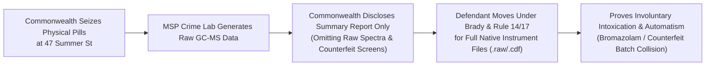

# ⚖️ COMMONWEALTH OF MASSACHUSETTS • SUPERIOR COURT DEPARTMENT
## PLYMOUTH COUNTY • DOCKET NO. 2383CR00048

```
COMMONWEALTH OF MASSACHUSETTS,
        Prosecution,

v.

LINDSAY CLANCY,
        Defendant.
____________________________________________/
```

### DEFENDANT'S EMERGENCY MOTION FOR AN ORDER COMPELLING PRODUCTION OF NATIVE ELECTRONIC MASS SPECTROMETRY DATA (.RAW / .CDF) AND CHAIN-OF-CUSTODY TOXICOLOGICAL PROFILES OF SEIZED PHARMACEUTICAL EVIDENCE

**NOW COMES the Defendant, Lindsay Clancy**, by and through counsel, and respectfully moves this Honorable Court pursuant to **Rule 14(a)(1)(C) and Rule 17(c) of the Massachusetts Rules of Criminal Procedure**, the **Sixth and Fourteenth Amendments to the United States Constitution**, **Article 12 of the Massachusetts Declaration of Rights**, and the seminal mandate of ***Brady v. Maryland*, 373 U.S. 83 (1963)**, for an Order compelling the Commonwealth (Plymouth County District Attorney’s Office) and the Massachusetts State Police Crime Laboratory (Forensic Chemistry & Toxicology Units) to immediately produce the following native electronic data and physical evidence:

---

### I. SPECIFIC ITEMS OF EVIDENCE DEMANDED

1. **Native Electronic Analytical Instrument Files:**
   * All raw, unredacted electronic data files (`.raw`, `.cdf`, `.wiff`, `.d`, `.mzXML`) generated by Gas Chromatography-Mass Spectrometry (GC-MS), Liquid Chromatography-Tandem Mass Spectrometry (LC-MS/MS), and High-Resolution Accurate-Mass Spectrometry (HRAMS) during the chemical analysis of:
     * All blood, serum, and urine specimens collected from Lindsay Clancy on or after January 24, 2023.
     * All physical pharmaceutical tablets, capsules, liquids, and pill remnants seized pursuant to search warrants executed at **47 Summer St, Duxbury, MA**.
2. **Untargeted Mass Spectrometry Screening Data:**
   * Full analytical spectrum data extending beyond standard targeted drug panels, specifically to detect the presence of:
     * **Designer Research Chemical Benzodiazepines:** Bromazolam, Clonazolam, Flualprazolam, Desalkylgidazepam, and Etizolam.
     * **Synthetic Opioids & Adulterants:** Fentanyl analogues, Xylazine, and industrial tablet binding contaminants.
3. **Physical Toolmark & Macroscopic Die Comparison Data:**
   * Calibrated 3D microscopic surface topology and punch-die toolmark scans of the seized Clonazepam, Zolpidem, and Lorazepam tablets to compare toolmark striations against commercial rotary pill press dies seized in **regional illicit manufacturing raids** (specifically the Massachusetts State Police raid on **122 Commercial St, Whitman, MA**).
4. **Complete Quantitative Potency Reports:**
   * Quantitative potency assays establishing the exact active pharmaceutical ingredient (API) concentration per tablet to verify whether the seized prescription stock contained dangerous **hot-spots (300%–500% dosing surges)** typical of counterfeit rotary presses.

---

### II. LEGAL ARGUMENT IN SUPPORT OF COMPULSORY PRODUCTION



#### A. The Evidence Is Exculpatory Under *Brady v. Maryland* and *Commonwealth v. Ellison*
* Under *Brady v. Maryland* (373 U.S. at 87) and *Commonwealth v. Ellison* (376 Mass. 1), the Commonwealth has an absolute, non-delegable constitutional duty to disclose any evidence that tends to exculpate the accused or support a recognized legal defense.
* The Defendant has asserted the defense of **Involuntary Intoxication** (*Commonwealth v. Sheehan*, 376 Mass. 765; *Commonwealth v. Darch*).
* If the physical medications prescribed to Lindsay Clancy were contaminated, adulterated with research chemicals (such as Bromazolam), or exhibited uncalibrated chemical spikes, the Defendant was **involuntarily intoxicated as a matter of law**, completely vitiating criminal intent (*mens rea*).

#### B. Summary Laboratory Reports Are Insufficient; Native Instrument Files Are Required
* Standard one-page summary laboratory certificates report only binary ("Positive/Negative") results against narrow, pre-configured library lists.
* Only the **native electronic data files (`.raw` / `.cdf`)** allow defense toxicologists to re-process the raw total ion chromatograms (TIC) against the complete **NIST / SWGDRUG / Cayman Spectral Libraries** to identify novel designer benzodiazepines that were present in regional circulation in Plymouth County during January 2023.

#### C. Geographic and Temporal Nexus to the Whitman Pill Lab Raid
* On December 21, 2023, Massachusetts State Police raided an industrial counterfeit rotary pill press laboratory operated by Andrew Billings at **122 Commercial St, Whitman, MA—less than 15 miles from the Defendant’s home**.
* Seized at that location were multi-station commercial rotary presses pressing tens of thousands of counterfeit Clonazepam and Xanax tablets laced with research chemicals.
* Depriving the Defendant of the raw toolmark scans and spectral data necessary to cross-compare her prescribed medications with the seized Whitman tooling violates her fundamental Sixth Amendment right to present a complete defense.

---

### III. PRAYER FOR RELIEF

**WHEREFORE**, the Defendant respectfully requests that this Honorable Court:
1. **GRANT** this Motion in its entirety;
2. **ORDER** the Commonwealth and the Massachusetts State Police Crime Laboratory to produce all native electronic instrument files (`.raw`, `.cdf`, `.wiff`, `.d`), chain-of-custody logs, and quantitative potency reports within **fourteen (14) days**;
3. **ORDER** that the physical pill evidence and biological samples be preserved without alteration or destructive testing pending independent defense laboratory inspection.

```
Respectfully submitted,
By her attorney,

__________________________________________
Kevin J. Reddington, Esq. (BBO # 412700)
Reddington & Reddington
Brockton, Massachusetts

DATED: August 24, 2026
```
