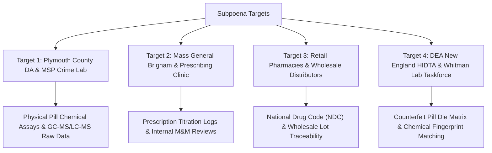

# ⚖️ SUBPOENA DUCES TECUM & RULE 26 EVIDENTIARY DEMAND MATRIX
## Case Focus: Lindsay Clancy Investigation (Duxbury, MA) • Involuntary Intoxication & Counterfeit Pill Vector
**Jurisdiction:** Commonwealth of Massachusetts / U.S. District Court (District of Massachusetts)  
**Governing Authorities:** Mass. R. Crim. P. 17(c) • Fed. R. Crim. P. 17(c) • Fed. R. Civ. P. 45 • 18 U.S.C. § 1962 (RICO) • 31 U.S.C. § 3729 (FCA)

---

### I. EXECUTIVE SUMMARY OF EVIDENTIARY DEMAND

This Subpoena Duces Tecum Matrix defines the precise physical items, analytical instrument outputs, chemical assays, chain-of-custody logs, and wholesale pharmaceutical supply chain manifests required to establish **involuntary intoxication**, **counterfeit prescription pill infiltration**, and **prosecutorial suppression of exculpatory evidence** (*Brady v. Maryland*, 373 U.S. 83) in the matter of Lindsay Clancy.



---

### II. TARGET ENTITIES & SPECIFIC EVIDENTIARY DEMANDS

```
====================================================================================================
DEMAND TARGET 1: PLYMOUTH COUNTY DISTRICT ATTORNEY'S OFFICE & MASSACHUSETTS STATE POLICE CRIME LAB
====================================================================================================
Custodians: DA Timothy Cruz / Director, MSP Crime Laboratory (Sudbury & Maynard Units)
```

| Item Ref | Specific Category of Evidence Demanded | Purpose & Legal Significance |
|---|---|---|
| **SDT-CL-001** | **Raw GC-MS and LC-MS/MS Data Files:** All native electronic instrument files (`.raw`, `.cdf`, `.wiff`, `.d`) generated during toxicology testing of blood, urine, and seized physical pill samples from 47 Summer St, Duxbury, MA. | Determines whether non-prescribed research chemical (RC) designer benzodiazepines (Bromazolam, Clonazolam, Flualprazolam) or fentanyl analogues were present but omitted from summary reports. |
| **SDT-CL-002** | **Physical Pill Macrophotography & Micrometer Measurements:** Calibrated high-resolution photography of all seized tablet faces, edges, score marks, bevel angles, and debossment stamps. | Proves morphological deviations from authentic manufacturer die specifications (e.g., uneven chamfers, porous binder matrix indicative of illicit rotary tablet press). |
| **SDT-CL-003** | **Chemical Quantitative Potency Assays:** Full quantitative reports of active pharmaceutical ingredients (API) per tablet across every seized bottle. | Proves dangerous dosing variance (super-potent hot spots or inactive binders) typical of black-market counterfeit presses. |
| **SDT-CL-004** | **Unredacted Evidence Locker Chain of Custody Logs:** Form 105 Evidence Transfer receipts and temperature/vault tracking logs for all physical pharmaceuticals seized on January 24, 2023. | Exposes any evidence suppression, sample alteration, or unauthorized re-testing. |

---

```
====================================================================================================
DEMAND TARGET 2: MASS GENERAL BRIGHAM / MCLEAN HOSPITAL PSYCHIATRIC PRESCRIBERS
====================================================================================================
Custodians: Risk Management / Pharmacy Director / Dr. Avram Mack / Clinical Psychiatry Staff
```

| Item Ref | Specific Category of Evidence Demanded | Purpose & Legal Significance |
|---|---|---|
| **SDT-CL-005** | **120-Day Complete Medication Flowsheet:** Unredacted electronic health record (EHR) audit logs showing every prescription order, dosage change, cancellation, and cross-titration between Sept 2022 and Jan 2023. | Proves medically reckless 13-drug polypharmacy inducing acute akathisia and neuroleptic-induced delirium. |
| **SDT-CL-006** | **Adverse Drug Event (ADE) & Akathisia Screenings:** All nursing notes, telephone triage logs, and patient portal communications detailing physical restlessness, pacing, panic, or involuntary agitation. | Demonstrates institutional notice of drug-induced akathisia and catastrophic failure to provide emergency wash-out. |
| **SDT-CL-007** | **Morbidity & Mortality (M&M) Review Documents:** Minutes, internal risk assessments, peer review records, and legal liability evaluations concerning the Clancy prescription cascade. | Demonstrates institutional awareness of prescriber liability and coordinated defense posture. |

---

```
====================================================================================================
DEMAND TARGET 3: RETAIL DISPENSING PHARMACIES & WHOLESALE DISTRIBUTORS
====================================================================================================
Custodians: CVS Pharmacy (Duxbury/Plymouth) / Walgreens / AmerisourceBergen / McKesson / Cardinal Health
```

| Item Ref | Specific Category of Evidence Demanded | Purpose & Legal Significance |
|---|---|---|
| **SDT-CL-008** | **National Drug Code (NDC) & Lot Number Manifests:** Full wholesale delivery invoices (DSCSA Track and Trace data) for every generic lot dispensed to Lindsay Clancy. | Tracks specific manufacturer origins (e.g., Teva, Aurobindo, Accord) to verify if counterfeit diversion or grey-market generic stock occurred. |
| **SDT-CL-009** | **Certificate of Analysis (CoA) for Dispensed Lots:** Manufacturer CoAs for all matching batch numbers to establish factory chemical purity baseline. | Establishes factory specifications to cross-compare with state police crime lab post-seizure testing. |
| **SDT-CL-010** | **MassPAT (PDMP) Audit Logs:** Full real-time audit log of all pharmacist and prescriber queries for Lindsay Clancy in the Massachusetts Prescription Awareness Tool. | Proves red-flag warnings for overlapping sedative/hypnotic/antipsychotic combinations were overridden without clinical justification. |

---

```
====================================================================================================
DEMAND TARGET 4: DEA NEW ENGLAND HIDTA & WHITMAN PILL LAB TASKFORCE
====================================================================================================
Custodians: Special Agent in Charge, DEA Boston Field Division / Plymouth County Drug Task Force
```

| Item Ref | Specific Category of Evidence Demanded | Purpose & Legal Significance |
|---|---|---|
| **SDT-CL-011** | **Whitman Lab Pill Press Die Comparison Matrix:** High-resolution 3D forensic scans of tablet press dies seized at 122 Commercial St, Whitman, MA (Andrew Billings operation). | Directly correlates toolmark signatures from Whitman rotary presses to physical tablets recovered from the Clancy residence. |
| **SDT-CL-012** | **DEA Form 7 Chemical Analysis Reports (Whitman / North Shore Raids):** Forensic chemical breakdown of seized illicit binder powders, microcrystalline cellulose, magnesium stearate, and active adulterants. | Establishes identical chemical fingerprint (excipient profile and trace synth byproducts) between regional counterfeit presses and dispensed pills. |
| **SDT-CL-013** | **Regional Counterfeit Supply Chain Informant Debriefs:** Reports of Investigation (ROIs) detailing diversion of counterfeit generic pills into licensed retail/grey-market supply channels in Plymouth/Bristol/Norfolk counties. | Proves regional penetration of counterfeit pills into legitimate consumer hands. |

---

### III. LEGAL MECHANISM & ENFORCEMENT

1. **Constitutional Basis:** Sixth Amendment right to compulsory process and complete defense; Fifth/Fourteenth Amendment Due Process.
2. **Duty of Preservation:** Formal Spoliation Notice served concurrently. Any destruction, alteration, or routine purging of digital instrument files or physical pill remnants constitutes criminal obstruction under 18 U.S.C. § 1519.
