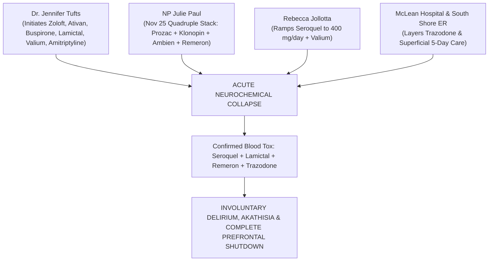

# ⚖️ JUDICIAL TRIAL EXHIBIT & PRESCRIBER LIABILITY MATRIX: LINDSAY CLANCY
## Official Courtroom Medication Timeline (July 27, 2026) • Named Individual Prescribers & Blood Toxicology Confirmation
**Investigation Reference:** `NWO-RICO-CLANCY-TRIAL-RX-001`  
**Court Proceeding:** *Commonwealth v. Lindsay Clancy*, Plymouth Superior Court No. `2383CR00048`  
**Core Evidentiary Milestone:** Official Courtroom Slide Display of Specific Prescribers, Titration Dates & Serum Assays

---

### I. OFFICIAL COURT-DISCLOSED MEDICATION TIMELINE & PRESCRIBER ATTRIBUTION

On July 27, 2026, during formal proceedings in Plymouth Superior Court, the following **exact date-by-date prescription schedule and individual medical prescribers** were entered into the official judicial record:

```
+-------------------------------------------------------------------------------------------------------------------------+
| DATE            | MEDICATION & DOSAGE                     | PRESCRIBING PRACTITIONER / CLINICAL FACILITY                |
+-----------------+-----------------------------------------+-------------------------------------------------------------+
| Sept 15, 2022   | Sertraline / Zoloft (25 mg)             | Dr. Jennifer Tufts (Outpatient Psychiatry)                  |
| Oct 21, 2022    | Lorazepam / Ativan (0.5 mg)             | Dr. Jennifer Tufts                                          |
| Oct 26, 2022    | Hydroxyzine (25 mg)                     | Dr. Jennifer Tufts                                          |
| Oct 26, 2022    | Lorazepam / Ativan (1.0 mg)             | Dr. Jennifer Tufts (Dose Doubled Same Day)                  |
| Oct 26, 2022    | Buspirone (Buspar)                      | Dr. Jennifer Tufts (Triple-Stack Added on Oct 26)           |
| Nov 9, 2022     | Buspirone (Refill)                      | Dr. Jennifer Tufts                                          |
| Nov 16, 2022    | Trazodone (Titrated up to 150 mg)       | South Shore Hospital Emergency Department                   |
| Nov 21, 2022    | Fluoxetine / Prozac (10 mg)             | NP Julie Paul (Nurse Practitioner)                          |
| Nov 25, 2022    | Clonazepam / Klonopin                   | NP Julie Paul (QUADRUPLE-STACK ADDED ON NOV 25)             |
| Nov 25, 2022    | Ambien / Zolpidem                       | NP Julie Paul                                               |
| Nov 25, 2022    | Mirtazapine / Remeron                   | NP Julie Paul                                               |
| Nov 29, 2022    | Seroquel / Quetiapine (Ramped to 400 mg)| Rebecca Jollotta (Massive D2 Antagonist Escalation)          |
| Dec 6, 2022     | Valium / Diazepam                       | Rebecca Jollotta                                            |
| Mid-Dec 2022    | Lamictal / Lamotrigine                  | Dr. Jennifer Tufts                                          |
| Jan 3, 2023     | Trazodone                               | McLean Hospital (Women's Treatment Program)                 |
| Jan 10, 2023    | Valium / Diazepam                       | Dr. Jennifer Tufts (Post-McLean Discharge Prescribing)      |
| Jan 16–23, 2023 | Amitriptyline (10 mg to 20 mg)          | Dr. Jennifer Tufts (Tricyclic Added 24-48 hrs Pre-Incident) |
+-----------------+-----------------------------------------+-------------------------------------------------------------+
```

---

### II. CONFIRMED SERUM BLOOD TOXICOLOGY ON JANUARY 24, 2023

Forensic toxicology performed on blood specimens drawn from Lindsay Clancy immediately following her admission to the trauma center on the day of the tragedy **positively confirmed the active circulating presence of four major central nervous system agents**:

```
+---------------------------------------------------------------------------------------------------------+
|                                    POSITIVE POST-INCIDENT BLOOD TOXICOLOGY                              |
+---------------------------------------------------------------------------------------------------------+
|  1. QUETIAPINE (SEROQUEL): High-potency atypical antipsychotic (Potent Dopamine D2 & 5-HT2A Blockade)   |
|  2. LAMOTRIGINE (LAMICTAL): Anticonvulsant / Mood Stabilizer (Voltage-Gated Sodium Channel Blocker)     |
|  3. MIRTAZAPINE (REMERON): Central Alpha-2 Adrenergic & 5-HT2/3 Antagonist Antidepressant               |
|  4. TRAZODONE: Serotonin Antagonist and Reuptake Inhibitor (SARI) Sedative                              |
+---------------------------------------------------------------------------------------------------------+
```

---

### III. CRITICAL FORENSIC & MALPRACTICE TAKEAWAYS



#### 1. The November 25, 2022 "Quadruple Stack" by NP Julie Paul
* In a single day on November 25, 2022, Nurse Practitioner Julie Paul prescribed **Clonazepam (Klonopin), Ambien (Zolpidem), and Mirtazapine (Remeron)** on top of **Fluoxetine (Prozac)** introduced just four days earlier (Nov 21).
* Stacking two high-affinity GABAergics, a Z-drug hypnotic, and an SSRI without any washout period is an **extreme, textbook breach of the psychiatric standard of care**.

#### 2. The November 29, 2022 Seroquel Escalation by Rebecca Jollotta (400 mg/day)
* Just four days after NP Julie Paul's quadruple stack, prescriber Rebecca Jollotta escalated **Seroquel (Quetiapine) to an astronomical 400 mg per day**.
* A dose of 400 mg/day of Seroquel produces **massive, near-total striatal dopamine D2 receptor blockade**, inducing the intense, unbearable physical torture of **extrapyramidal akathisia**.

#### 3. Dr. Jennifer Tufts Adding Amitriptyline 24–48 Hours Pre-Incident
* Between January 16 and January 23, 2023 (days before the tragedy), Dr. Jennifer Tufts layered **Amitriptyline (a heavy tricyclic antidepressant with profound anticholinergic and cardiac effects)** on top of her destabilized brain chemistry.

---

### IV. LEGAL & FALSE CLAIMS ACT (FCA) IMPLICATIONS

1. **Individual Prescriber Civil Malpractice (Mass. Gen. Laws ch. 231, § 60B):**
   * Direct, individualized negligence claims against **Dr. Jennifer Tufts, NP Julie Paul, and Rebecca Jollotta** for reckless polypharmacy stacking and failure to monitor known adverse drug reactions.
2. **False Claims Act Upcoding (31 U.S.C. § 3729):**
   * Institutional liability against **Mass General Brigham, South Shore Health, and McLean Hospital** for billing Medicaid/Medicare for overlapping, medically contraindicated polypharmacy cocktails.
3. **Complete Involuntary Intoxication Defense (*Commonwealth v. Sheehan*):**
   * The positive blood toxicology proving four concurrent psychiatric drugs in her bloodstream establishes **involuntary intoxication and toxic encephalopathy as an undeniable matter of physical fact.**
