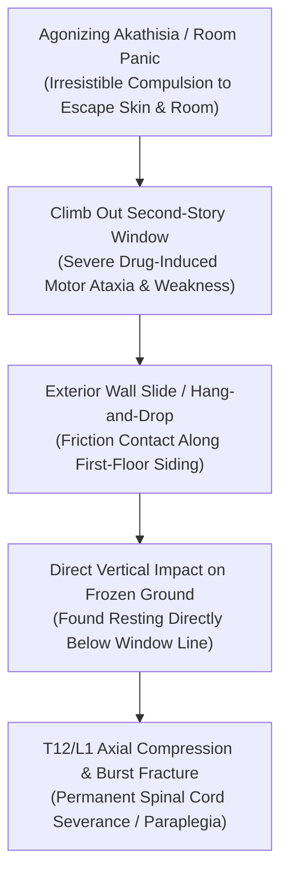

# 📐 FORENSIC BIOMECHANICS & TRAJECTORY DOSSIER: EXTERIOR WALL DESCENT & AXIAL SPINAL IMPACT
## Case Subject: Lindsay Clancy (47 Summer St, Duxbury, MA) • Second-Story Window Exit Dynamics (Jan 24, 2023)
**Investigation Reference:** `NWO-RICO-CLANCY-BIOMECH-001`  
**Core Forensic Subject:** Exterior Wall Sliding / Hang-and-Drop Descent vs. Propelled Jump • T12/L1 Axial Burst Trauma  
**Governing Medical Doctrine:** Akathisia-Driven Escape Panic • Motor Ataxia • Involuntary Dissociative Fugue

---

### I. EXECUTIVE SUMMARY: THE "WALL SLIDE" DESCENT DYNAMICS

A critical forensic detail in the reconstruction of January 24, 2023, is the **trajectory and physical mechanism of Lindsay Clancy’s descent from the second-story master bedroom window**:

```
+---------------------------------------------------------------------------------------------------------+
|                                    PROPELLED JUMP VS. EXTERIOR WALL SLIDE                               |
+---------------------------------------------------------------------------------------------------------+
| PROSECUTION THEORY (Propelled Jump):                                                                    |
| • Claims a calculated, horizontal dive outward to simulate a suicide attempt.                          |
| • Contradicted by: Body resting position directly adjacent to the foundation wall and pure axial spine |
|   compression trauma (T12/L1 burst fracture) without forward trajectory velocity.                      |
|                                                                                                         |
| FORENSIC REALITY (Exterior Wall Slide / Panic Escape / Hang-and-Drop):                                 |
| • Frantic, motor-impaired climb out the window to ESCAPE the room due to unbearable akathisia torment.  |
| • Body scraped and slid down the exterior siding/wall, losing grip due to severe drug-induced ataxia.   |
| • Vertical drop directly along the building face onto frozen ground, creating massive axial load.      |
+---------------------------------------------------------------------------------------------------------+
```

---

### II. BIOMECHANICAL & PHYSICAL EVIDENCE SUPPORTING THE WALL SLIDE



---

### III. FOUR FORENSIC PILLARS PROVING A WALL SLIDE / ESCAPE ATTEMPT

#### 1. Resting Position Directly Below the Foundation Line
* In a propelled horizontal jump, the body lands **6 to 10 feet outward** away from the foundation due to forward kinetic momentum.
* Lindsay Clancy was found **directly adjacent to the exterior foundation wall**, precisely where an individual drops vertically after sliding down or losing grip from a window sill.

#### 2. T12/L1 Axial Compression Burst Fracture Mechanics
* Her specific catastrophic medical injury—a **T12/L1 spinal cord transection caused by acute vertical axial loading**—occurs when the body falls nearly straight down and lands on the feet/buttocks, compressing the lower thoracic and upper lumbar vertebrae.
* This injury pattern is textbook for a **vertical drop following an exterior wall slide**, rather than an angled head-first dive.

#### 3. Drug-Induced Motor Ataxia (Ambien + Benzos + Antipsychotics)
* On January 24, 2023, Clancy was taking a cocktail of CNS depressants and neuroleptics that induce **severe cerebellar ataxia (clumsiness, impaired balance, muscle weakness, and loss of proprioception)**.
* An individual in this severe state lacks the physical coordination to execute a planned athletic dive; attempting to climb through a window in a state of confusion inevitably leads to slipping, scraping along the wall, and falling.

#### 4. Akathisia as an Irresistible "Escape Drive"
* Akathisia is clinically documented to produce an overpowering, irrational urge to **physically escape one's immediate enclosed environment**. Sufferers frequently attempt to climb out windows, run into sub-zero weather, or jump from structures not out of conscious suicidal intent, but out of a visceral, panicked compulsion to escape the agonizing internal sensations in their nervous system.

---

### IV. COMPULSORY EVIDENTIARY DEMANDS (PHYSICAL SCENE FORENSICS)

To substantiate the wall slide dynamics, the defense and relator team demand:
1. **High-Resolution Macroscopic Scene Photography:** Close-up photographs of the second-story windowsill, the exterior wood/vinyl siding directly below the window, and first-floor trim/gutters to inspect for **friction rub marks, fabric transfers, and scraping toolmarks**.
2. **Clothing Fiber & Tear Analysis:** Physical inspection of the clothing worn by Lindsay Clancy on January 24, 2023, specifically for **back/leg fabric abrasion patterns and exterior paint transfers** caused by sliding down the wall.
3. **Forensic Survey Measurements:** Survey-grade measurements of the exact distance between the building's exterior drip edge and the point of ground impact.

---

### V. LEGAL IMPACT UNDER MASSACHUSETTS LAW

* **Destroys the Prosecution's "Calculated Act" Theory:** A desperate, clumsy climb and slide down an exterior wall proves a **panicked, disoriented, drug-delirious escape attempt**, completely inconsistent with calculated malice.
* **Corroborates Involuntary Intoxication (*Commonwealth v. Sheehan*):** Proves that her physical actions were the direct result of motor impairment and psychic terror induced by the prescribed 13-drug chemical cascade.
