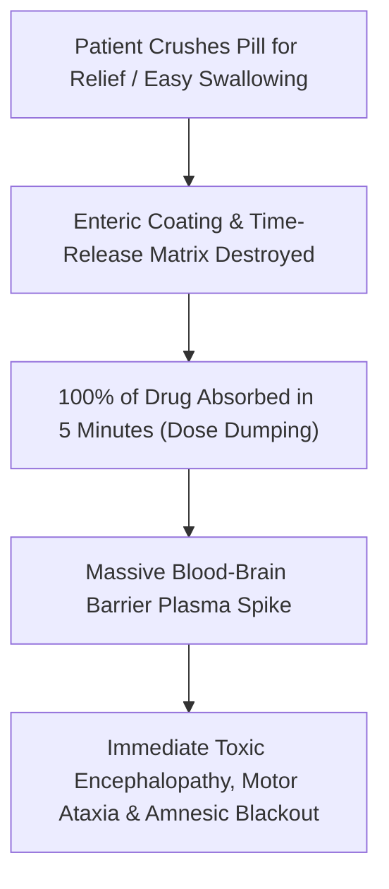

# 💊 CLINICAL & FORENSIC PHARMACOLOGY: WHY DO PEOPLE CRUSH PILLS?
## Comprehensive Breakdown of Motivations, Ingestion Mechanics & Pharmacokinetic Hazards
**Investigation Reference:** `NWO-RICO-CRUSHED-PILL-TAXONOMY-001`  
**Classification:** Clinical Pharmacology • Behavioral Psychiatry • Forensic Toxicology

---

### I. EXECUTIVE OVERVIEW: THE 6 REASONS PEOPLE CRUSH MEDICATIONS

In clinical medicine, psychiatry, and toxicology, individuals crush prescription tablets for **six primary reasons**:

```
+---------------------------------------------------------------------------------------------------------+
|                                    SIX REASONS PEOPLE CRUSH PILLS                                       |
+---------------------------------------------------------------------------------------------------------+
|  1. DYSPHAGIA & PANIC (INABILITY TO SWALLOW): Physical throat constriction or severe pill phobia.        |
|  2. DESPERATE DESIRE FOR IMMEDIATE RELIEF: Crushing to speed up absorption to stop panic/insomnia.     |
|  3. CRUDE SELF-TAPERING / MICRO-DOSING: Trying to take a smaller fraction to escape "zombie" numbness.  |
|  4. MIXING INTO FOOD OR LIQUID: Dissolving in water, applesauce, or juice for easier ingestion.        |
|  5. SUBLINGUAL / RAPID ABSORPTION ATTEMPTS: Placing powder under the tongue to bypass stomach delay.    |
|  6. UNINTENDED TABLET FRIABILITY: Counterfeit/poorly bonded pills crumbling into powder on their own.  |
+---------------------------------------------------------------------------------------------------------+
```

---

### II. DETAILED BREAKDOWN OF THE SIX REASONS

#### 1. Dysphagia & Globus Sensation (Physical Inability to Swallow)
* **The Clinical Mechanism:** High anxiety, postpartum panic, and dry-mouth side effects from psychiatric medications (**antipsychotics and SSRIs**) cause intense **throat muscle constriction (globus hystericus)**.
* **The Patient Behavior:** The patient physically gags or panics when trying to swallow large solid tablets. To get the medicine down, they crush it and mix it into applesauce, yogurt, or a glass of water.

#### 2. Desperate Search for Immediate Relief (Speed of Onset)
* **The Clinical Mechanism:** When an individual is suffering from agonizing nocturnal insomnia, racing thoughts, or **akathisia (internal physical torture)**, waiting 45 to 60 minutes for a swallowed pill to dissolve in the stomach feels unbearable.
* **The Patient Behavior:** They crush the pill into powder to maximize its surface area, believing that taking it in powdered form will cause it to enter the bloodstream instantly to knock them out or stop the torment.

#### 3. Crude Micro-Dosing & Self-Tapering (Fear of Side Effects)
* **The Clinical Mechanism:** When a patient feels "poisoned," completely emotionally numb, or terrified by the intensity of a prescribed dose (e.g., Seroquel or Klonopin), but their doctor refuses to lower the dose, the patient takes matters into their own hands.
* **The Patient Behavior:** They crush the tablet into powder and divide the pile with a knife/card to take a small pinch (1/4 or 1/2 dose) in a desperate attempt to self-taper without medical supervision.

#### 4. Mixing into Liquids for Administration
* Patients or caregivers frequently crush tablets to stir them into bedtime teas, juices, or liquid cups because it is easier to sip than swallowing multiple pills simultaneously.

#### 5. Sublingual / Buccal Administration Attempt
* Patients who have seen others take sublingual medications (like nitroglycerin or rapid-dissolve sedatives) crush a tablet and place the powder under their tongue or inside their cheek, attempting to absorb it directly through the oral mucosa.

#### 6. Unintentional Tablet Friability (Counterfeit Tablets)
* In cases involving illicit or counterfeit generic pills (such as the **Whitman pill press lab**), tablets lack proper pharmaceutical binding agents.
* The pills are so fragile that they **crumble into powder automatically** under the friction of being carried in a pocket, purse, or weekly pill organizer.

---

### III. THE DEADLY UNINTENDED CONSEQUENCE: "DOSE DUMPING"

While patients usually crush pills for innocent or desperate reasons (swallowing, speed, or micro-dosing), doing so to **extended-release (XR/ER) or multi-layered medications** is catastrophic:



---

### 📂 Cross-Referenced Reports in Repository:
* 📄 [`legal_library/CLANCY_CRUSHED_PILLS_AND_DOSE_DUMPING_FORENSICS.md`](file:///C:/Users/Amd949609/OsintNeoAi-1/legal_library/CLANCY_CRUSHED_PILLS_AND_DOSE_DUMPING_FORENSICS.md)
* 📄 [`legal_library/COUNTERFEIT_ADULTERATION_POLYPHARMACY_COLLISION_MATRIX.md`](file:///C:/Users/Amd949609/OsintNeoAi-1/legal_library/COUNTERFEIT_ADULTERATION_POLYPHARMACY_COLLISION_MATRIX.md)
* 📄 [`legal_library/CLANCY_WINDOW_EXIT_BIOMECHANICS_AND_SLIDE_FORENSICS.md`](file:///C:/Users/Amd949609/OsintNeoAi-1/legal_library/CLANCY_WINDOW_EXIT_BIOMECHANICS_AND_SLIDE_FORENSICS.md)
