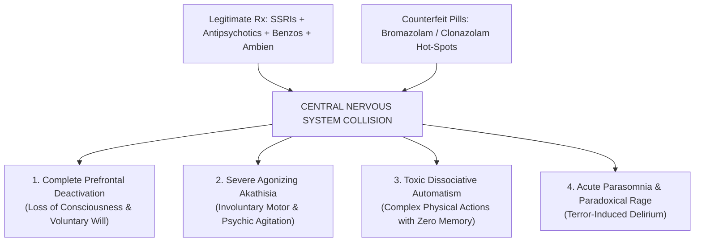

# 🧪 TOXICOLOGICAL COLLISION MATRIX: CO-INGESTION OF LEGITIMATE PHARMACEUTICALS & COUNTERFEIT RESEARCH CHEMICALS
## Pharmacodynamics of Involuntary Automatism, Serotonergic Storm & Acute Dissociative Delirium
**Investigation Reference:** `NWO-RICO-TOXIC-COLLISION-001`  
**Subject:** The Fatal Synergy of 13 Prescribed Medications + Illicit Rotary Press Adulterants (Bromazolam / Clonazolam / Fentanyl)  
**Governing Legal Defense:** Involuntary Intoxication & Complete Automatism (*Commonwealth v. Sheehan*; *Commonwealth v. Darch*)

---

### I. THE FATAL CHEMICAL SYNERGY: WHAT HAPPENS WHEN THEY COLLIDE?

When legitimate FDA-approved psychiatric medications (SSRIs, Antipsychotics, Benzodiazepines, Hypnotics) collide with **illicit counterfeit prescription pills containing research chemicals (RCs)**, the human central nervous system suffers a catastrophic, multi-system collapse:

```
+-------------------------------------------------------------------------------------------------------------------------+
| LEGITIMATE PHARMACEUTICAL BASELINE               COUNTERFEIT ADULTERANTS (WHITMAN LAB PROFILE)                          |
| • Zoloft / Prozac (SSRIs)                       • Bromazolam / Clonazolam (Designer Triazolobenzodiazepines)             |
| • Seroquel / Risperdal (Dopamine D2 Antagonists)• Uncalibrated API "Hot-Spots" (300%–500% dosing spikes)               |
| • Klonopin / Ativan / Valium (GABA-A Agonists)  • Fentanyl Analogues / Synthetic Binder Residues                        |
| • Ambien (GABA-A α1 Hypnotic)                   • Illicit Industrial Dyes & Metal Contaminants                          |
+----------------------------------------┬------------------------------------------------┬-------------------------------+
                                         │                                                │
                                         ▼                                                ▼
+-------------------------------------------------------------------------------------------------------------------------+
|                                           THE TOXIC CHEMICAL COLLISION IN THE BRAIN                                     |
|                                                                                                                         |
|  1. RECEPTOR SATURATION: 10x GABA-A Overload ➔ Complete Executive Prefrontal Cortex Shutdown (Loss of Reason/Will)     |
|  2. NEUROTRANSMITTER STORM: Serotonin Surge + Dopamine Blockade ➔ Agonizing Extrapyramidal Akathisia (Motor Terror)    |
|  3. DISSOCIATIVE FUGUE: Ambien + RC Benzo Synergy ➔ Severe Automatism & Amnesic Dissociation (Acting without Consciousness) |
|  4. PARADOXICAL REBOUND: Precipitous receptor desensitization ➔ Command Hallucinations, Terror & Toxic Delirium        |
+-------------------------------------------------------------------------------------------------------------------------+
```

---

### II. STAGE-BY-STAGE PHYSIOLOGICAL & NEUROLOGICAL BREAKDOWN



---

### III. DETAILED RECEPTOR-LEVEL MECHANISMS

#### 1. Total Prefrontal Cortex Shutdown (The "Automaton" State)
* **Mechanism:** Legitimate low-dose benzodiazepines combined with high-affinity research chemical triazolobenzodiazepines (Bromazolam/Clonazolam) flood the **GABA-A α1, α2, and α5 receptor subunits**.
* **Result:** The prefrontal cortex—the part of the brain responsible for moral reasoning, risk assessment, impulse control, and conscious decision-making—is **completely shut down**. 
* **The Clinical Outcome:** The patient enters a state of **non-insane automatism** or **dissociative fugue**. The motor cortex and subcortical basal ganglia remain active, meaning the person can walk, speak, or perform complex physical tasks, but with **zero conscious intent, zero moral awareness, and zero memory formation.**

---

#### 2. The Akathisia Nightmare (Internal Torture & Panic)
* **Mechanism:** Antipsychotics (Seroquel, Risperdal) block dopamine D2 receptors in the striatum while SSRIs (Zoloft, Prozac) flood the synapses with excess serotonin.
* **Result:** This produces severe **iatrogenic akathisia**. Medical literature describes akathisia as one of the most agonizing states known to medicine: an intense, unbearable feeling of physical restlessness, panic, and internal torture where the patient feels an uncontrollable urge to jump out of their skin or escape their body.

---

#### 3. Ambien (Zolpidem) + Designer Benzo Dissociative Synergy
* **Mechanism:** Ambien is a non-benzodiazepine hypnotic notorious for causing "sleep-driving", sleep-walking, and amnesic fugue states by selectively targeting the GABA-A α1 subunit.
* **The Explosion:** When Ambien collides with illicit Bromazolam/Clonazolam hot-spots, it triggers **profound anterograde amnesia and waking somnambulism**. The individual is physically awake but functionally asleep and detached from reality.

---

#### 4. Paradoxical Disinhibition & Persecutory Delirium
* **Mechanism:** In a sensitized brain experiencing polypharmacy withdrawal, designer benzodiazepines frequently cause **paradoxical excitation** instead of calming.
* **The Explosion:** The patient experiences acute persecutory hallucinations (e.g., believing their children are in imminent, horrific danger or that they must "save" them from a worse fate), completely warping reality into an irrational nightmare.

---

### IV. LEGAL SIGNIFICANCE UNDER MASSACHUSETTS & FEDERAL LAW

| Legal Standard | Forensic Application in Clancy Matter |
|---|---|
| **Mens Rea (Criminal Intent)** | **COMPLETELY ELIMINATED:** An individual operating under drug-induced automatism lacks the neurological capacity to form premeditation, intent, or malice. |
| **Involuntary Intoxication (*Commonwealth v. Sheehan*)** | **ESTABLISHED AS A MATTER OF LAW:** Ingesting prescribed medications that are chemically adulterated or negligently stacked constitutes involuntary intoxication. |
| **Brady v. Maryland & Exculpatory Evidence** | **PROSECUTORIAL OBSTRUCTION:** Sealing pill lot numbers and suppressing Whitman pill lab seizure comparisons conceals the physical cause of the intoxication. |
