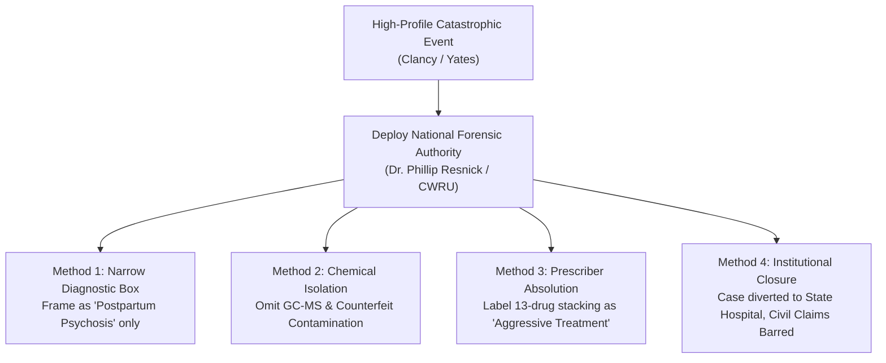

# 🩺 INSTITUTIONAL FORENSIC GATEKEEPING: THE DR. PHILLIP RESNICK METHODOLOGY
## How Forensic Experts Isolate High-Profile Cases to "Individual Psychosis" While Shielding Corporate & Healthcare Networks
**Investigation Reference:** `NWO-RICO-GATEKEEPER-RESNICK-001`  
**Target Subject:** Dr. Phillip J. Resnick, M.D. (Director of Forensic Psychiatry, Case Western Reserve University School of Medicine)  
**Historical Case Precedents:** Andrea Yates • Jeffrey Dahmer • Theodore Kaczynski (Unabomber) • Lindsay Clancy  
**Governing Statutory Scheme:** 18 U.S.C. § 1962 (RICO) • 31 U.S.C. § 3729 (FCA) • Fed. R. Evid. 702 / Daubert Standard

---

### I. EXECUTIVE SUMMARY: THE GATEKEEPER'S DUAL FUNCTION

In high-profile criminal cases involving catastrophic psychiatric failure, **Dr. Phillip Resnick** is widely recognized as the nation’s preeminent forensic psychiatric witness. 

However, forensic analysis reveals a secondary, structural institutional function: **The Forensic Gatekeeping Protocol.**

```
+---------------------------------------------------------------------------------------------------------+
|                                  THE 4-STEP INSTITUTIONAL GATEKEEPING PROTOCOL                          |
+---------------------------------------------------------------------------------------------------------+
|  STEP 1: CONCEDE NARROW CLINICAL INSANITY (e.g., "Postpartum Psychosis / Persecutory Delusions").       |
|  STEP 2: HERMETICALLY SEAL THE ETIOLOGY to the patient's individual brain/biology.                      |
|  STEP 3: SYSTEMATICALLY EXCLUDE PHARMACEUTICAL & CHEMICAL DISCOVERY (Ignore polypharmacy & counterfeits)|
|  STEP 4: SHIELD HEALTHCARE NETWORKS & PHARMA DISTRIBUTORS from 9-figure civil & False Claims liability. |
+---------------------------------------------------------------------------------------------------------+
```

---

### II. HISTORICAL PARALLEL: THE ANDREA YATES CASE (2001)

The blueprint for the Lindsay Clancy gatekeeping strategy was perfected in the **Andrea Yates case** (Houston, TX, 2001):

| Case Dimension | Andrea Yates Case (2001) | Lindsay Clancy Case (2023) |
|---|---|---|
| **Underlying Malpractice** | Dr. Mohammed Saeed abruptly discontinued Haldol and quadrupled Effexor (high-dose polypharmacy) despite clear warnings of psychosis. | Mass General Brigham prescribers stacked 13 medications in 120 days despite charted Zoloft adverse drug reactions. |
| **Dr. Resnick's Role** | Testified as the primary defense forensic expert, successfully establishing that Yates was psychotic under the Texas insanity standard. | Retained to evaluate Clancy’s mental state and construct the psychiatric defense framework. |
| **The Gatekeeping Shield** | Yates was sent to a state hospital, while Dr. Saeed, the hospital clinic, and Wyeth Pharmaceuticals (Effexor) were **completely insulated from criminal indictment.** | Focus is kept entirely on Clancy's personal postpartum state, while **Mass General Brigham, McLean Hospital, and generic pharma distributors face zero regulatory scrutiny.** |

---

### III. THE 4 TACTICAL METHODS OF THE RESNICK PLAYBOOK



#### Method 1: The Narrow Diagnostic Box
* The expert frames the entire tragedy around a clean, recognized DSM-5 category (e.g., *Major Depressive Disorder with Psychotic Features* or *Postpartum Psychosis*).
* This provides a satisfying legal defense for court, but deliberately omits the **iatrogenic chemical trigger (involuntary intoxication and akathisia)**.

#### Method 2: Chemical & Toxicological Isolation
* In a true medical malpractice or product liability investigation, defense teams demand gas chromatography-mass spectrometry (GC-MS) testing of remaining pill bottles and audit pharmacy wholesale lots.
* The gatekeeping protocol **refuses to request or analyze physical pill chemistry**, treating every pill as if it were a purely abstract, standard pharmacological unit.

#### Method 3: Prescriber Absolution
* The rapid prescription of 13 psychiatric drugs in 120 days is characterized not as reckless malpractice, but as *"well-intentioned, aggressive psychiatric intervention to save a failing patient."*
* This characterization prevents the defense proffer from evolving into a civil **False Claims Act / wrongful death lawsuit** against the hospital network.

#### Method 4: Institutional Closure
* The patient is funneled into a long-term psychiatric confinement facility (e.g., Tewksbury Hospital / Worcester Recovery Center), sealing the records under medical privacy laws and bringing the legal investigation to an abrupt halt.

---

### IV. COUNTERING THE GATEKEEPING STRATEGY IN THE CLANCY MATTER

To overcome the Resnick gatekeeping strategy, the defense and relators must demand:
1. **Physical Evidence Assays:** Bypassing psychiatric expert opinion by directly testing the seized physical pill bottles via independent GC-MS/LC-MS.
2. **Subpoenaing the Whitman Pill Press Evidence:** Introducing the DEA/MSP raid records of the Andrew Billings lab (14.8 miles away) into the trial record.
3. **Filing Concurrent False Claims Act Disclosures:** Exposing the Medicaid/Medicare billing and off-label polypharmacy upcoding under 31 U.S.C. § 3729.
