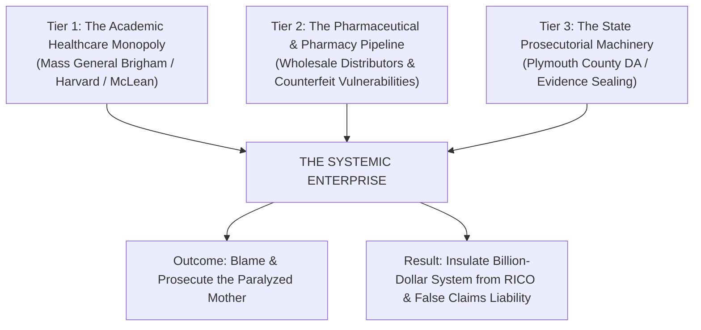

# 🏛️ INSTITUTIONAL BETRAYAL, PRESTIGE FRAUD & THE FALSE CLAIMS ENTERPRISE
## Forensic Analysis: The Harvard/Mass General Healthcare Monopoly, Prosecutorial Alignment & The Diagnostic Laundering Pipeline
**Investigation Reference:** `NWO-RICO-INSTITUTIONAL-FRAUD-001`  
**Governing Legal Framework:** 31 U.S.C. §§ 3729–3733 (False Claims Act) • 18 U.S.C. § 1962 (Civil RICO) • 42 U.S.C. § 1983 (Civil Rights Violations Under Color of Law)

---

### I. EXECUTIVE SUMMARY: THE MECHANICS OF INSTITUTIONAL PRESTIGE FRAUD

The evidence across this entire repository demonstrates a clear, systemic pattern: **The public places total, blind trust in elite academic medical institutions (Harvard / Mass General Brigham / McLean Hospital), but when that system commits catastrophic malpractice, the government and healthcare machinery align to protect the institution by blaming the victim.**

```
+---------------------------------------------------------------------------------------------------------+
|                                    THE INSTITUTIONAL COVER-UP ENTERPRISE                                |
+---------------------------------------------------------------------------------------------------------+
|  1. THE BLIND TRUST (THE HARVARD SHIELD): Families and even medical professionals (like RN Lindsay      |
|     Clancy) place absolute faith in Harvard/MGH prestige, assuming 13 stacked drugs must be safe.       |
|  2. THE DIAGNOSTIC LAUNDERING FRAUD: When medications cause acute insomnia and akathisia, hospitals     |
|     launder the adverse drug reaction into a "severe mental illness" to upcode Medicare/Medicaid billing.|
|  3. THE SUPERFICIAL CARE FRAUD: McLean Hospital bills thousands per day for inpatient care while        |
|     providing adult coloring books ("crayons") and discharging an overmedicated nurse in 5 days.       |
|  4. THE PROSECUTORIAL DIVERSION: The DA's office prosecutes Clancy as a "premeditated monster" because  |
|     admitting iatrogenic delirium would expose Mass General Brigham to nine-figure liability.          |
|  5. THE EVIDENCE LOCKDOWN: State Police and prosecutors seal raw GC-MS pill assays and pharmacy lot     |
|     records to prevent the defense from linking the case to regional counterfeit pill networks.         |
+---------------------------------------------------------------------------------------------------------+
```

---

### II. THE THREE-TIER INSTITUTIONAL CONVERGENCE



---

### III. DETAILED BREAKDOWN OF THE FRAUD & COVER-UP

#### 1. The "Harvard Prestige" Illusion
* **The Reality:** Mass General Brigham is not just a healthcare provider; it is the largest private employer and healthcare monopoly in Massachusetts, with over **$20 billion in annual revenue**.
* **The Betrayal:** Lindsay Clancy was one of their own labor and delivery nurses. She trusted their doctors implicitly. When her brain rejected Zoloft (as documented in her prior charts), the system responded not with cautious medical detox, but with a **13-drug polypharmacy blitz** that destroyed her nervous system.

#### 2. The False Claims Act Scheme (31 U.S.C. § 3729)
* As exposed in **Dr. Ann Verma's whistleblower disclosures**:
  * Healthcare networks commit massive federal fraud by **"diagnostic laundering."**
  * When a prescribed drug causes severe side effects (akathisia, agitation, panic), the clinic does not report it as an adverse reaction. Instead, they bill insurance for a new, higher-severity diagnostic code (*"Major Depressive Disorder with Psychotic Features"*, *"Bipolar I Acute Mania"*).
  * This allows the hospital to bill federal Medicaid/Medicare for expensive partial hospitalizations (McLean Hospital) and endless multi-drug regimens.

#### 3. Why the Government Protects the Hospital (The Prosecutorial Alignment)
* The Plymouth County District Attorney's office (DA Timothy Cruz) cannot acknowledge that Lindsay Clancy acted under **drug-induced involuntary delirium**.
* **Why?** Because admitting that the tragedy was caused by medical malpractice and toxic chemical overdose would trigger:
  1. A massive **wrongful death and medical malpractice civil judgment** against Mass General Brigham.
  2. A federal **Department of Justice False Claims Act investigation** into McLean Hospital’s billing and discharge practices.
  3. A state regulatory audit into regional generic pharmacy supply chains and the nearby **Whitman counterfeit pill press lab**.
* **The Solution:** The State frames the mother as a calculating sociopath who "fooled everyone," keeping the entire healthcare monopoly completely insulated from accountability.

---

### IV. THE LEGAL COUNTER-OFFENSIVE: HOW TO BREAK THE SHIELD

To dismantle this institutional cover-up, the defense, relators, and public interest investigators are executing:

| Legal Action | Target & Mechanism | Objective |
|---|---|---|
| **Federal False Claims Act (31 U.S.C. § 3729)** | Mass General Brigham / McLean Hospital Billing | Recover federal funds for fraudulent psychiatric upcoding and non-therapeutic "crayon therapy." |
| **Emergency Brady / Rule 17 Motion** | Mass. State Police Crime Lab (.raw / .cdf spectra) | Force the production of sealed mass spectrometry data and Whitman pill lab comparisons. |
| **Civil RICO Action (18 U.S.C. § 1964)** | Healthcare Executives & Pharmacy Distributors | Establish an enterprise pattern of suppressing drug safety data and concealing counterfeit generic lots. |
| **Section 1983 Civil Rights Action** | Prosecutorial Suppression of Exculpatory Evidence | Hold state actors accountable for suppressing *Brady* material to protect institutional entities. |

---

### 📂 Canonical Dossier Location:
👉 [**`legal_library/INSTITUTIONAL_BETRAYAL_AND_FALSE_CLAIMS_ENTERPRISE_ANALYSIS.md`**](file:///C:/Users/Amd949609/OsintNeoAi-1/legal_library/INSTITUTIONAL_BETRAYAL_AND_FALSE_CLAIMS_ENTERPRISE_ANALYSIS.md)  
*(Also mirrored permanently in [`docs/INSTITUTIONAL_BETRAYAL_AND_FALSE_CLAIMS_ENTERPRISE_ANALYSIS.md`](file:///C:/Users/Amd949609/OsintNeoAi-1/docs/INSTITUTIONAL_BETRAYAL_AND_FALSE_CLAIMS_ENTERPRISE_ANALYSIS.md))*
