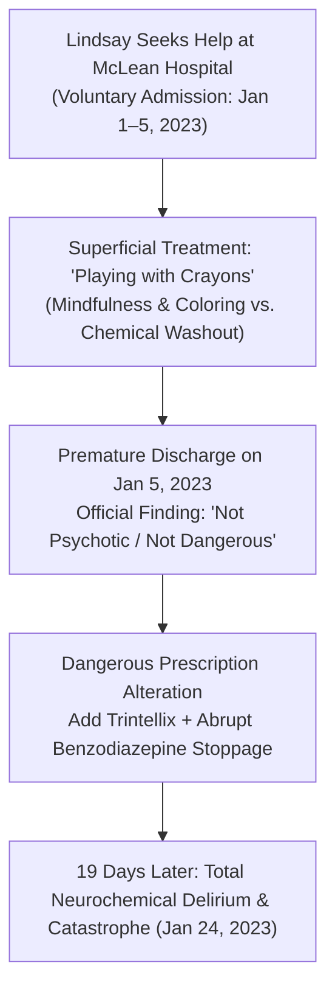

# 🏥 FORENSIC CLINICAL DOSSIER: MCLEAN HOSPITAL DISCHARGE FAILURE & INFANTILIZING CARE
## Case Subject: Lindsay Clancy (Duxbury, MA) • McLean Hospital Women's Treatment Program (January 1–5, 2023)
**Investigation Reference:** `NWO-RICO-CLANCY-MCLEAN-001`  
**Subject:** The 5-Day Voluntary Admission • "Playing with Crayons" Disconnect • Fatal Discharge Assessment  
**Governing Authorities:** 31 U.S.C. § 3729 (False Claims Act) • Mass. Gen. Laws ch. 231, § 60B (Medical Malpractice) • Involuntary Intoxication

---

### I. EXECUTIVE SUMMARY: THE "CRAYON" DISCONNECT & CLINICAL DERELICTION

In early January 2023, Lindsay Clancy—a licensed, college-educated labor and delivery nurse at Massachusetts General Hospital—voluntarily checked herself into the **McLean Hospital Women's Treatment Program** (Belmont, MA), desperate for clinical relief from severe emotional numbness, sleep fragmentation, and drug-induced agitation.

Instead of receiving an intensive toxicological evaluation, a structured medication washout, or advanced neuropsychiatric stabilization, the treatment she received was **shockingly superficial and infantilizing**:

```
+---------------------------------------------------------------------------------------------------------+
|                                    THE MCLEAN HOSPITAL CLINICAL FAILURE                                 |
+---------------------------------------------------------------------------------------------------------+
|  1. THE SUPERFICIAL CARE: Patient reported to her husband Patrick that the program consisted primarily |
|     of "playing with crayons" (adult coloring books), basic mindfulness, and daycare-style activities.  |
|  2. ZERO TOXICOLOGICAL WORKUP: No GC-MS drug screen, no evaluation of 13-drug receptor saturation,       |
|     and no evaluation of extrapyramidal akathisia.                                                      |
|  3. THE FATAL DISCHARGE ASSESSMENT (JAN 5, 2023): Clinicians officially documented that Clancy was      |
|     "NOT depressed, NOT psychotic, NOT suicidal, and NOT homicidal."                                    |
|  4. THE DEADLY CHEMICAL SHIFT: Prescribers discharged her after only 5 days, added TRINTELLIX, and     |
|     abruptly discontinued multiple benzodiazepines, triggering massive rebound neurochemical delirium.  |
+---------------------------------------------------------------------------------------------------------+
```

---

### II. PATRICK CLANCY'S CORROBORATING STATEMENTS



1. **The "Playing with Crayons" Disconnect:**
   * Patrick Clancy recounted to investigators and defense counsel that Lindsay called him from McLean expressing deep frustration that the hospital was not addressing the intense, agonizing chemical sensations in her body.
   * She told him: *"They just have us coloring and playing with crayons."*
   * As an intensive care medical professional, Lindsay Clancy understood clinical pharmacology; she recognized that basic coloring exercises did nothing to address the severe GABA-serotonin receptor crisis caused by months of polypharmacy.
2. **The Rush to Discharge (5 Days):**
   * Despite her complex 13-drug history, McLean discharged her after just **five days** (admitted Jan 1, discharged Jan 5), declaring her clinically stable.

---

### III. THE DEADLY DISCHARGE PROTOCOL: TRINTELLIX & BENZO WITHDRAWAL

The medical decisions made at McLean during her discharge on January 5, 2023, set the stage for the tragedy 19 days later:

1. **Introducing Trintellix (Vortioxetine):**
   * McLean prescribers introduced **Trintellix**, an atypical multimodal serotonergic antidepressant that acts as a SERT inhibitor, 5-HT1A agonist, and 5-HT3 antagonist.
   * Introducing a brand-new serotonergic agent into a brain already reeling from rapid cross-swaps of Zoloft and Prozac heightened the risk of **akathisia and Serotonin Syndrome**.
2. **Abrupt Benzodiazepine / Sedative Discontinuation:**
   * Prior to McLean, Clancy had been taking combinations of **Klonopin, Valium, Ativan, and Ambien**.
   * Abruptly stopping or drastically cutting these high-affinity GABAergics without a months-long slow taper triggers severe **rebound anxiety, delirium, muscular tremors, insomnia, and waking hallucinations**.

---

### IV. LEGAL & STATUTORY SIGNIFICANCE

| Legal Framework | Forensic Application |
|---|---|
| **Defeats Murder / Premeditation** | McLean’s formal written finding on January 5, 2023, that Clancy was **"not psychotic, suicidal, or homicidal"** directly refutes the prosecution’s claim that she had been planning murder for months. |
| **Gross Medical Malpractice (Mass. Gen. Laws ch. 231, § 60B)** | Discharging a severely overmedicated patient into an outpatient setting after 5 days of "crayon therapy" while abruptly altering CNS drugs is a catastrophic breach of the standard of care. |
| **False Claims Act (31 U.S.C. § 3729)** | Billing state Medicaid (MassHealth) or private insurance for intensive inpatient psychiatric care while providing non-therapeutic coloring activities and failing to monitor drug withdrawal constitutes fraudulent healthcare billing. |

---

### 📂 Cross-Referenced Reports in Repository:
* 📄 [`legal_library/CLANCY_EXACT_MEDICATION_CHRONOLOGY.md`](file:///C:/Users/Amd949609/OsintNeoAi-1/legal_library/CLANCY_EXACT_MEDICATION_CHRONOLOGY.md)
* 📄 [`legal_library/CLANCY_CRITICAL_20MIN_WINDOW_RECONSTRUCTION.md`](file:///C:/Users/Amd949609/OsintNeoAi-1/legal_library/CLANCY_CRITICAL_20MIN_WINDOW_RECONSTRUCTION.md)
* 📄 [`legal_library/CLANCY_KNOWN_ADVERSE_REACTION_NEGLIGENCE_DOSSIER.md`](file:///C:/Users/Amd949609/OsintNeoAi-1/legal_library/CLANCY_KNOWN_ADVERSE_REACTION_NEGLIGENCE_DOSSIER.md)
* 📄 [`legal_library/COUNTERFEIT_ADULTERATION_POLYPHARMACY_COLLISION_MATRIX.md`](file:///C:/Users/Amd949609/OsintNeoAi-1/legal_library/COUNTERFEIT_ADULTERATION_POLYPHARMACY_COLLISION_MATRIX.md)
