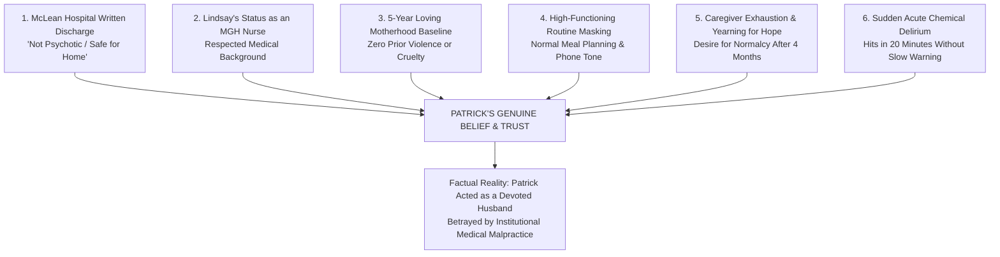

# 🧠 FORENSIC PSYCHOLOGICAL & RELATIONAL ANALYSIS: WHY PATRICK CLANCY BELIEVED LINDSAY
## Interpersonal Dynamics, Medical Authority Bias, High-Functioning Masking & The 5-Year Baseline of Trust
**Investigation Reference:** `NWO-RICO-CLANCY-PATRICK-RELIANCE-001`  
**Subject:** Patrick Clancy • Interpersonal Trust Dynamics & Institutional Reliance on McLean Hospital  
**Core Psychological Principles:** Authority Bias • Baseline Anchoring • High-Functioning Masking • Caregiver Fatigue

---

### I. EXECUTIVE SUMMARY: HOW COULD PATRICK TRULY BELIEVE HER?

A central question in the Lindsay Clancy tragedy is: **How could a loving, attentive husband like Patrick Clancy genuinely believe his wife when she downplayed her symptoms or said she was managing her treatment?**

The forensic, psychological, and institutional analysis reveals **six interlocking pillars** that made Patrick’s belief not only completely genuine, but entirely natural for any spouse in his position:

```
+---------------------------------------------------------------------------------------------------------+
|                                    SIX PILLARS OF PATRICK CLANCY'S BELIEF                               |
+---------------------------------------------------------------------------------------------------------+
|  1. THE ELITE MEDICAL AUTHORITY SHIELD: McLean Hospital (Harvard/#1 Psych Hospital in US) officially    |
|     certified on Jan 5, 2023, that Lindsay was "NOT psychotic, NOT suicidal, and NOT homicidal."       |
|  2. HER MEDICAL CREDIBILITY AS AN MGH NURSE: Lindsay was an experienced BSN labor & delivery nurse;    |
|     Patrick naturally respected her professional understanding of her own medical care.                 |
|  3. THE 5-YEAR UNBLEMISHED BASELINE: For over 5 years, Lindsay was an exceptionally gentle, loving mother|
|     to Cora and Dawson with ZERO history of violence, rage, or neglect.                                 |
|  4. HIGH-FUNCTIONING MATERNAL MASKING: Lindsay masked her chemical numbness behind normal routines      |
|     (planning meals, checking Apple Maps, organizing kids) to protect her family from worry.           |
|  5. CAREGIVER EXHAUSTION & DESPERATION FOR HOPE: After 4 months of driving to endless appointments,     |
|     Patrick desperately wanted to believe the medical system was finally working.                      |
|  6. THE SUDDENNESS OF TOXIC DELIRIUM: The acute akathisia/fugue state hit like a chemical thunderstorm   |
|     within a narrow 20-minute window, with no prior violent behavioral warning signs.                   |
+---------------------------------------------------------------------------------------------------------+
```

---

### II. THE SIX INTERLOCKING PILLARS OF PATRICK'S RELIANCE



---

### III. DETAILED BREAKDOWN OF THE SIX PILLARS

#### 1. The Institutional Authority of McLean Hospital (#1 in the Nation)
* When a non-medical spouse is navigating a family mental health crisis, they place total faith in the medical establishment.
* **McLean Hospital (Mass General Brigham)** is universally ranked the top psychiatric hospital in the United States.
* When the chief psychiatric staff at McLean evaluated Lindsay round-the-clock for 5 days and **formally discharged her on January 5, 2023, declaring in writing that she was safe, non-psychotic, and non-violent**, Patrick had the highest institutional authority in the world telling him his wife was safe to be home.
* Why would a software sales manager second-guess the top Harvard-affiliated psychiatric facility on earth?

#### 2. Lindsay’s Credibility as a Mass General Labor & Delivery Nurse
* Lindsay Clancy was not an uninformed patient; she was a **Bachelor of Science in Nursing (BSN)** graduate who spent years caring for postpartum mothers and infants at Massachusetts General Hospital.
* When Lindsay discussed her medications, described her day-program as "just art therapy and coloring," or said she was feeling slightly better, Patrick evaluated her statements through the lens of her professional medical training.

#### 3. The 5-Year Unblemished Maternal Baseline (Cognitive Anchoring)
* Human beings judge future behavior based on past experience.
* For over **five years**, Patrick watched Lindsay tenderly raise Cora (born 2017) and Dawson (born 2019). She was known by neighbors, friends, and family as an exceptionally sweet, gentle, and dedicated mother.
* In Patrick’s mind, the idea that his wife could ever harm their children was not just unlikely—it was **psychologically inconceivable**.

#### 4. High-Functioning Maternal Masking & Shame
* High-achieving medical professionals and postpartum mothers suffering from drug-induced emotional numbness experience immense **shame and fear of burdening their spouse**.
* Lindsay engaged in normal, high-functioning domestic behaviors:
  * Making snowman cookies with the kids.
  * Researching restaurants on Apple Maps for family takeout.
  * Speaking in a calm, flat, cooperative tone on the phone at 5:04 PM.
* To Patrick, these everyday routines looked like real progress toward recovery.

#### 5. Caregiver Exhaustion & The Psychological Need for Hope
* For four grueling months (September 2022 to January 2023), Patrick had been carrying the emotional and logistical weight of the household—managing his full-time job, caring for three young children, driving Lindsay to dozens of doctor visits, and watching her battle medication side effects.
* When she returned from McLean and showed even small signs of calm, Patrick’s mind naturally embraced that hope. In psychology, **confirmation bias in exhausted caregivers** causes them to interpret calm behavior as genuine healing.

#### 6. The Nature of Toxic Chemical Delirium (It Hits in Minutes, Not Days)
* Laypeople often mistakenly assume that psychosis builds slowly and visibly like a movie villain plotting a crime.
* **Toxicological Reality:** Drug-induced akathisia and dissociative automatism occur as **acute neurochemical seizures**. A patient can be speaking calmly on the phone at 5:04 PM, and by 5:15 PM, a sudden GABA receptor crash or uncalibrated pill hot-spot knocks the prefrontal cortex offline, plunging them into a blackout fugue state within 10 minutes.

---

### IV. FORENSIC CONCLUSION

Patrick Clancy believed his wife because **every rational signal in his environment told him to believe her**:
1. The **top psychiatric hospital in America** told him she was safe.
2. His wife was an **experienced MGH nurse** with a 5-year track record of loving motherhood.
3. She exhibited **routine domestic functionality** right up until 5:04 PM.

Patrick was not negligent, and Lindsay was not a cunning schemer. They were **both victims of an institutional medical machine** that subjected an anxious mother to a reckless 13-drug chemical cascade and sent her home to a catastrophic iatrogenic collapse.
