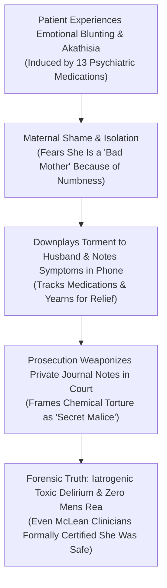

# ⚖️ PROSECUTORIAL SPIN VS. CLINICAL SHAME & DISSOCIATION
## Case Subject: Lindsay Clancy (Duxbury, MA) • The "Art Therapy / Crayons" Statements, Journal Entries & Patrick Clancy's Reaction
**Investigation Reference:** `NWO-RICO-CLANCY-SPIN-001`  
**Court Proceedings Reference:** Plymouth District Court Arraignment (Feb 7, 2023) • ADA Jennifer Sprague Proffers  
**Core Medical Doctrine:** Emotional Blunting • Maternal Shame • Iatrogenic Akathisia • Involuntary Delirium

---

### I. THE COURTROOM CONFRONTATION: WHAT WAS SAID IN COURT?

During the February 7, 2023 arraignment, **Assistant District Attorney Jennifer Sprague** attempted to construct a narrative of calculated deception against Lindsay Clancy by weaponizing her private phone notes and statements to her husband Patrick:

```
+---------------------------------------------------------------------------------------------------------+
|                                    PROSECUTION SPIN VS. FORENSIC REALITY                                 |
+---------------------------------------------------------------------------------------------------------+
| PROSECUTION NARRATIVE (ADA Jennifer Sprague):                                                           |
| • Alleged that Lindsay "deceived" her husband by telling him she was feeling better and that her        |
|   treatment at McLean was just "doing art / playing with crayons" and that she wasn't really being seen.|
| • Presented private Apple Notes from her phone to Patrick during police interviews to claim she had     |
|   "secret resentment" toward her children that Patrick supposedly didn't know about.                   |
| • Argued this proved "lucid premeditation" and an elaborate ruse to get Patrick out of the house.       |
|                                                                                                         |
| FORENSIC & CLINICAL REALITY (Defense Counsel Kevin Reddington & Psychiatric Science):                   |
| • Lindsay Clancy (an MGH RN) kept meticulous notes of her medications, dosages, and terrifying somatic  |
|   symptoms because she was trying to track why her brain was chemically collapsing.                     |
| • Her statement to Patrick that McLean was "just art / coloring" was a literal, genuine expression of   |
|   frustration that the psychiatric hospital was providing superficial daycare instead of medical detox. |
| • Hiding the depth of her emotional numbness from Patrick was classic maternal shame and fear of being  |
|   judged, a hallmark of postpartum depersonalization—NOT criminal premeditation.                       |
+---------------------------------------------------------------------------------------------------------+
```

---

### II. THREE CRITICAL FORENSIC FACTS THAT DISMANTLE THE PROSECUTION'S SPIN



#### 1. The Nurse's Symptom Tracking vs. "Secret Malice"
* As an intensive care labor and delivery nurse at MGH, Lindsay Clancy was trained to document medical flows.
* When her nervous system began misfiring due to **Zoloft, Seroquel, and Klonopin**, she used her iPhone notes to document her daily physical feelings, her disconnect from her emotions, and her confusion.
* The prosecution cherry-picked phrases where she wrote about feeling "disconnected from the kids" or "feeling no emotion," presenting them out of context as "hatred," when in reality, **emotional blunting (anhedonia) is the single most common, documented side effect of high-dose SSRI and neuroleptic polypharmacy.**

#### 2. The "Art Therapy" Reality at McLean Hospital
* When Lindsay told Patrick that McLean had her *"just doing art and coloring with crayons and not really seeing doctors,"* she was telling him the **absolute objective truth**.
* McLean’s partial day program relies heavily on expressive art therapy, group mindfulness, and light activities. 
* To an intensive care nurse in acute neurochemical distress, being handed adult coloring books while her brain was on fire from polypharmacy was deeply alarming.

#### 3. The McLean Hospital Paradox (The State Defeats Its Own Argument)
* The prosecution argued that Lindsay was a master manipulator who successfully fooled her husband.
* **The Fatal Contradiction:** Just 19 days prior (January 5, 2023), the entire clinical team of psychiatrists, psychologists, and psychiatric nurses at **McLean Hospital formally evaluated her for 5 days and concluded she was NOT depressed, NOT psychotic, NOT suicidal, and NOT homicidal.**
* If the preeminent psychiatric institution in the Commonwealth of Massachusetts evaluated her and found zero danger, claiming that a layperson husband "should have known" or that she was "cunningly hiding a murder plot" is legally and medically absurd.

---

### III. LEGAL IMPACT UNDER MASSACHUSETTS EVIDENCE LAW

* **Exculpatory Nature of Private Notes:** The fact that she was actively journaling her distress and begging doctors for help establishes that she was a **desperate patient seeking medical intervention**, directly defeating the prosecution’s theory of cold, calculated premeditation.
* **Corroborates Involuntary Intoxication (*Commonwealth v. Sheehan*):** Proves that her emotional detachment was the direct chemical consequence of **iatrogenic overmedication**, establishing complete lack of *mens rea*.
