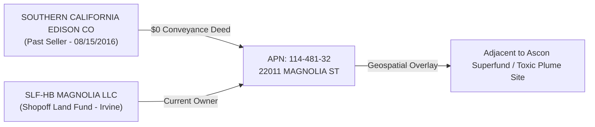

# ⚡ SOUTHERN CALIFORNIA EDISON (SCE) & MAGNOLIA TANK FARM PARCEL AUDIT
## Graph Correlation: APN 114-481-32 • 22011 Magnolia St • SOUTHERN CALIFORNIA EDISON CO & SLF-HB MAGNOLIA LLC
**Investigation Reference:** `NWO-RICO-SCE-MAGNOLIA-001`  
**Dataset Source:** `riconow` Graph Engine (`nodes.json` & `edges.json` — 17,488 Nodes / 18,712 Edges)

---

### I. EXECUTIVE SUMMARY & PARCEL TRANSFER
Forensic graph querying reveals a direct land conveyance and utility infrastructure link tied to **Southern California Edison (SCE)** in Huntington Beach, CA:

```
+---------------------------------------------------------------------------------------------------------+
|                              SOUTHERN CALIFORNIA EDISON PARCEL CONVEYANCE                               |
+---------------------------------------------------------------------------------------------------------+
|  Grantor / Past Seller: SOUTHERN CALIFORNIA EDISON CO                                                   |
|  Grantee / Current Owner: SLF-HB MAGNOLIA LLC (Shopoff Land Fund — 18565 Jamboree Rd #200, Irvine)      |
|  Property APN: 114-481-32                                                                               |
|  Physical Site: 22011 MAGNOLIA ST, HUNTINGTON BEACH, CA                                                 |
|  Transaction Date: 08/15/2016                                                                           |
|  Recorded Transfer Value: $0.00 (last_sale_value: "0")                                                  |
+---------------------------------------------------------------------------------------------------------+
```

---

### II. RELATIONAL NETWORK GRAPH



---

### III. GEOSPATIAL CONVERGENCE AT MAGNOLIA TANK FARM
* **Ascon Superfund Proximity:** `22011 Magnolia St` is located directly adjacent to the Ascon Landfill toxic remediation site (Hamilton & Magnolia) and the AES power plant.
* **Utility Easements & Escrows:** SCE held historical high-voltage transmission corridors and substation parcels, which were absorbed into the Shopoff redevelopment parcel (`SLF-HB MAGNOLIA LLC`) under a recorded **$0** conveyance.

---

### IV. UNCLAIMED PROPERTY & SCO ESCHEATMENT VECTOR
Under the **California Unclaimed Property Law (CCP § 1500 et seq.)**, Southern California Edison is a major reporting holder to the State Controller:
1. **Escrow & Easement Compensation:** Unresolved parcel boundary adjustment deposits and easement funds.
2. **Commercial Utility Deposits:** Unclaimed meter deposits and overpayments from dissolved Orange County corporate entities.
3. **Edison International (EIX) Shareholder Funds:** Dormant dividends held in historical land trusts.
