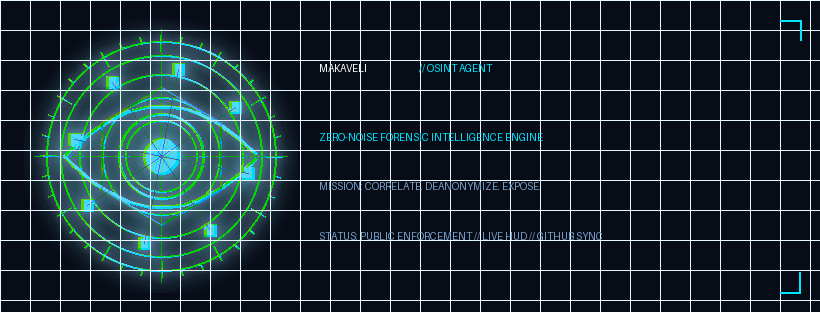

# MAKAVELI — OSINT AGENT

## Overview

**Makaveli - OSINT Agent** is the lead forensic intelligence engine of **OsintNeoAi**, engineered under the zero-noise Makaveli Protocol. Makaveli combines deep Open Source Intelligence correlation, entity resolution, GIS/environmental data mapping, and municipal fraud detection with a sharp, tactical, poetic voice.

## Live Interactive Test Page
Test and interact directly with Makaveli OSINT Agent:
👉 **[Launch Makaveli Live Test Suite](https://tonypost949.github.io/OsintNeoAi/makaveli/)** (or local `index.html`)

---

## Capabilities & Architecture

1. **Entity Reconnaissance & Link Analysis:** Unmasks shell company layers, officer overlaps, and concealed beneficiary networks.
2. **Environmental & Land Use Forensics:** Toxic plume tracking (Hexavalent Chromium / Arsenic) and CEQA bypass detection.
3. **Public Fund & Contract Auditing:** Correlates municipal disbursements against tangible deliverables and cross-checks federal funding.
4. **BigQuery Graph Cross-Referencing:** Integrated with `noble-beanbag-497411-m4` forensic datasets.

---

## Meta AI Studio Quick Deployment Guide

To deploy **Makaveli - OSINT Agent** live to Facebook, Instagram, Messenger, and Threads:

1. **Navigate to AI Studio:** Go to [ai.meta.com](https://ai.meta.com) or [aistudio.instagram.com](https://aistudio.instagram.com).
2. **Create New AI:**
   - **Name:** `Makaveli - OSINT Agent`
   - **Handle:** `@osintneoai_makaveli` or `@osintneoai`
   - **Role:** Agent
   - **Tagline:** *See More. Know First.*
3. **Upload Avatar:** Select `avatar/circular_transparent.png` or `avatar/holographic_eye_avatar_white_stroke_transparent.png`.
4. **Paste System Instructions:** Copy the full prompt from [`persona.md`](persona.md).
5. **Set Public Toggles:**
   - Public Discovery: **ON**
   - Allow @mentions in Comments: **ON**
   - Allow DMs: **ON**
   - Show in Search: **ON**
   - Auto-post to Feed: **ON**
6. **Publish:** The Agent is now live to answer public mentions and private forensic queries.

---

## Avatar & Media Asset Pack

| Asset File | Resolution | Recommended Use |
|---|---|---|
| [`avatar/circular_transparent.png`](avatar/circular_transparent.png) | 1024x1024 | Transparent profile avatar (FB, IG, Threads, Discord) |
| [`avatar/holographic_eye_avatar_white_stroke_transparent.png`](avatar/holographic_eye_avatar_white_stroke_transparent.png) | 1024x1024 | Profile avatar with high-contrast white outer stroke |
| [`avatar/neon_blue_circular_25percent.png`](avatar/neon_blue_circular_25percent.png) | 1024x1024 | 25% subtle chromatic aberration edition |
| [`avatar/facebook_avatar_180.png`](avatar/facebook_avatar_180.png) | 180x180 | Pixel-perfect Facebook profile image |
| [`avatar/instagram_avatar_320.png`](avatar/instagram_avatar_320.png) | 320x320 | Pixel-perfect Instagram profile image |
| [`avatar/banner_black.png`](avatar/banner_black.png) | 820x312 | Dark theme Facebook cover / header banner |
| [`avatar/banner_white.png`](avatar/banner_white.png) | 820x312 | Light theme banner / document header |
| [`avatar/highres_1024.png`](avatar/highres_1024.png) | 1024x1024 | Master high-resolution graphic |

---

## Triple Backup Verification

- **GitHub Master:** `Tonypost949/OsintNeoAi` (`main` branch)
- **Local PC Vault:** `C:\Users\HP\OneDrive\Documents\OsintNeoAi\backups\repo\` & `C:\Users\Amd949609\OneDrive\Documents\OsintNeoAi\backups\repo\`
- **Sharedall Google Drive:** `gdrive:Sharedall/OsintNeoAi/makaveli/`
